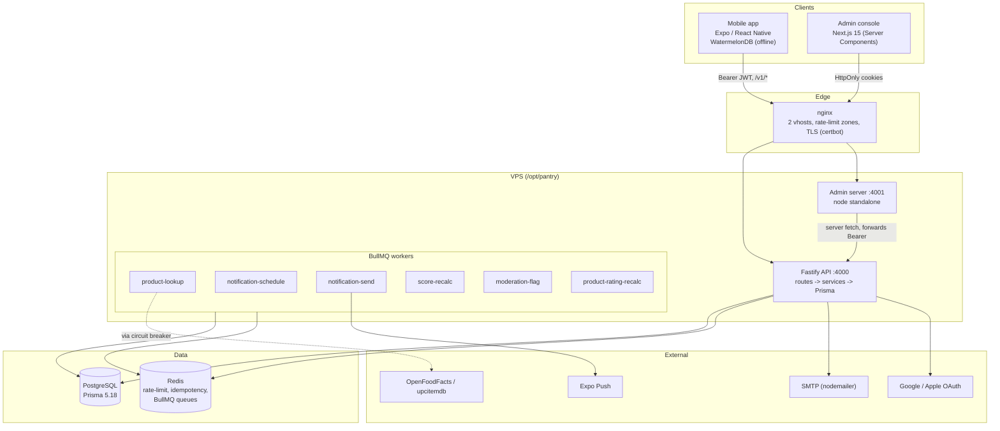

# Expyrico — System Architecture

## Overview

Expyrico is a self-hosted, three-tier system: a mobile client, a Next.js admin
console, and a shared Fastify API backed by PostgreSQL and Redis. Shared
contracts (`@expyrico/shared`) and design tokens (`@expyrico/theme`) are consumed
by all clients. Background work runs as BullMQ workers alongside the API.

## Components and data flow



## Request lifecycle (API)

Fastify plugin order is deliberate:

```
helmet -> CORS -> authPlugin -> idempotencyPlugin
  -> apiErrorRecorderPlugin -> rate-limit -> error-handler
```

- **helmet** applies security headers (default CSP — not hand-tuned).
- **CORS** allows no-origin requests (mobile native), the admin URL, and the
  `exp://` / `pantry://` schemes; `credentials: true`.
- **authPlugin** runs `onRequest` and populates `req.user` from the Bearer access
  token (jose, HS256). This happens **before** the rate limiter so limits can be
  keyed per-user vs per-IP.
- **idempotencyPlugin** caches responses for opt-in mutating routes in Redis for
  24h using the `Idempotency-Key` header.
- **apiErrorRecorderPlugin** persists notable failures to the `ApiError` model.
- **rate-limit** (`@fastify/rate-limit` via Redis): per-user 60/min, per-IP
  30/min, auth per-IP 10/min; toggle with `RATE_LIMIT_ENABLED`.
- **error-handler** returns problem+json shaped errors.

Handlers are thin (`routes/`), delegating to `services/` which own business logic
and all Prisma access.

## Authentication architecture

- **Access tokens**: JWT HS256 via jose, `JWT_ACCESS_SECRET` (>= 32 chars),
  default TTL 900s. Carried as Bearer headers (mobile-oriented).
- **Refresh**: DB-backed `Session` rows, 30-day TTL. Mobile does single-flight
  refresh on 401.
- **Passwords**: argon2id.
- **MFA**: TOTP (otplib) with an encrypted secret (`TOTP_ENCRYPTION_KEY`) and
  recovery codes; admin login forces TOTP enrollment.
- **Passkeys**: WebAuthn via @simplewebauthn/server (`WEBAUTHN_RP_ID`,
  `RP_NAME`, `ORIGIN`).
- **OAuth**: Google (`GOOGLE_CLIENT_ID`) and Apple (`APPLE_CLIENT_ID`/`TEAM_ID`/
  `KEY_ID`).
- **RBAC**: two roles (`user`, `admin`). Decorators `requireAuth` /
  `requireAdmin`, plus an admin-only plugin; admin actions logged to
  `AdminAuditLog`.

The admin console does not hold its own session store: it delegates to the API
and stores API tokens in HttpOnly cookies (`pantry_admin_access` 15min,
`pantry_admin_refresh` 30d) plus a readable CSRF cookie (`pantry_admin_csrf`).
Server-side requests read the access cookie and forward it as a Bearer token to
the API. CSRF is enforced via a double-submit token with timing-safe comparison.

## Data model

PostgreSQL via Prisma 5.18 (`api/prisma/schema.prisma`, 716 lines, 15
migrations). Domains: identity/auth (`User`, `AuthCredential`, `Session`,
`PushToken`, `EmailToken`, `PasswordReset`, `TotpChallenge`,
`TotpRecoveryCode`), catalog/records (`Product`, `ProductEdit`, `Record`,
`PushLog`), community (`Review`, `ReviewVote`, `Report`, `Deal`, `DealVote`,
`Giveaway`, `GiveawayClaim`, `TransactionRating`, `Referral`), households
(`Household`, `HouseholdMember`), and operations (`Setting`,
`NotificationTemplate`, `NotificationOutbox`, `ApiError`, `AdminAuditLog`).

A system user with a fixed UUID (ending `...0001`) owns system-generated actions
such as auto-flagged moderation reports.

## Offline-first sync

The mobile client stores records locally in WatermelonDB (SQLite) and syncs
push/pull with the API. Server-side (`services/records/sync.ts`):

- Sync work takes a Postgres **advisory transaction lock**
  (`pg_advisory_xact_lock`) keyed on the household UUID to serialize concurrent
  syncs for the same shared pantry.
- **Personal records**: last-write-wins.
- **Household records**: server-authoritative; scope changes surface as
  `scope_changed` conflicts to the client.

## Giveaway state machine

Giveaway transitions run through `services/giveaways/state-machine.ts`, each
wrapped in `prisma.$transaction`. Mutating endpoints require an
`Idempotency-Key`, so a retried request does not double-apply a transition.
`TransactionRating` records reputation on completed exchanges. There is no
currency involved anywhere in this flow.

## Background jobs

BullMQ + Redis (ioredis). Six workers run from `src/workers/runner.ts` (skipped
in test unless `RUN_WORKERS=1`):

| Worker | Responsibility |
| --- | --- |
| product-lookup | Enrich products from OpenFoodFacts + upcitemdb |
| notification-schedule | Schedule expiry reminders |
| notification-send | Deliver via Expo push (expo-server-sdk) |
| score-recalc | Recompute user reputation |
| moderation-flag | Profanity auto-flag -> reports as the system user |
| product-rating-recalc | Recompute Wilson-score product ratings |

Notifications use the **outbox** pattern: work is enqueued in the same DB
transaction as the state change, and `sweepOutbox` runs after commit so a
rolled-back transaction never emits a notification. Queue health is observable
via Bull-board mounted at `/v1/admin/bullboard` (admin-only).

## External integrations and resilience

Outbound calls to product-data APIs go through undici (`lib/http.ts`) wrapped in
opossum circuit breakers (`lib/breaker.ts`). Failures are recorded to the
`ApiError` model and surfaced in the admin `system/external-apis` view, so
degraded third parties are visible rather than silent.

## Edge and TLS

nginx runs two vhosts (API and admin) proxying to the local ports, with shared
rate-limit zones and sequence-aware TLS provisioning (HTTP-only until Let's
Encrypt certs exist, then HTTPS). The API vhost only allows `/`, `/v1/*`,
`/health`, `/health/ready`, and ACME paths; everything else returns 404. Both
vhosts set HSTS, `X-Content-Type-Options: nosniff`, and
`Referrer-Policy: no-referrer`; the admin vhost adds `X-Frame-Options: DENY`.
**No Content-Security-Policy is set at the edge or in either app** — a known gap.

See `deployment-guide.md` for the full infra topology.
