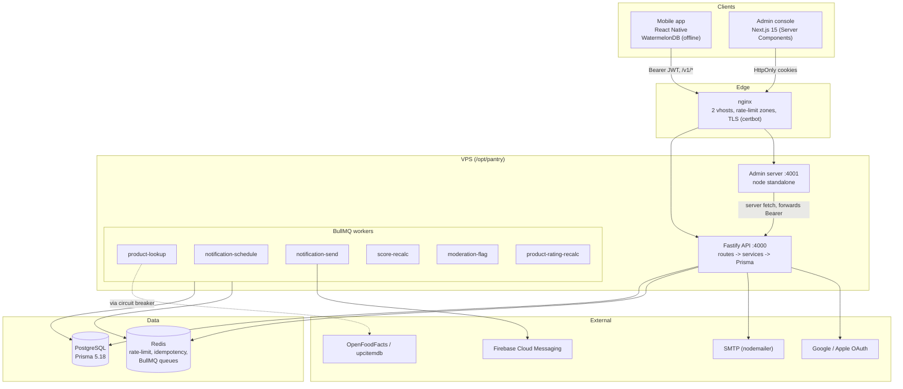

# Expyrico — System Architecture

## Overview

Expyrico is a self-hosted, three-tier system: a mobile client, a Next.js admin
console, and a shared Fastify API backed by PostgreSQL and Redis. Shared
contracts (`@expyrico/shared`) and design tokens (`@expyrico/theme`) are consumed
by all clients. Background work runs as BullMQ workers alongside the API.

## Components and data flow


```mermaid
flowchart TB
  subgraph Clients
    M["Mobile app<br/>React Native<br/>WatermelonDB (offline)"]
    A["Admin console<br/>Next.js 15 (Server Components)"]
  end

  subgraph Edge
    NG["nginx<br/>2 vhosts, rate-limit zones, TLS (certbot)"]
  end

  subgraph Backend["VPS (/opt/pantry)"]
    API["Fastify API :4000<br/>routes -> services -> Prisma"]
    ADM["Admin server :4001<br/>node standalone"]
    subgraph Workers["BullMQ workers"]
      W1["product-lookup"]
      W2["notification-schedule"]
      W3["notification-send"]
      W4["score-recalc"]
      W5["moderation-flag"]
      W6["product-rating-recalc"]
    end
  end

  subgraph Data
    PG[("PostgreSQL<br/>Prisma 5.18")]
    RD[("Redis<br/>rate-limit, idempotency,<br/>BullMQ queues")]
  end

  subgraph External
    OFF["OpenFoodFacts / upcitemdb"]
    FCM["Firebase Cloud Messaging"]
    SMTP["SMTP (nodemailer)"]
    OAUTH["Google / Apple OAuth"]
  end

  M -->|"Bearer JWT, /v1/*"| NG
  A -->|"HttpOnly cookies"| NG
  NG --> API
  NG --> ADM
  ADM -->|"server fetch, forwards Bearer"| API
  API --> PG
  API --> RD
  Workers --> PG
  Workers --> RD
  W1 -.->|"via circuit breaker"| OFF
  W3 --> FCM
  API --> SMTP
  API --> OAUTH
```

## Request lifecycle (API)

Fastify plugin order is deliberate:

```
helmet -> CORS -> authPlugin -> idempotencyPlugin
  -> apiErrorRecorderPlugin -> rate-limit -> error-handler
```

- **helmet** applies security headers (default CSP — not hand-tuned).
- **CORS** allows no-origin requests (mobile native), the admin URL, and the
  `exp://` / `pantry://` schemes; `credentials: true`.
- **authPlugin** runs `onRequest` and populates `req.user` from the Bearer access
  token (jose, HS256). This happens **before** the rate limiter so limits can be
  keyed per-user vs per-IP.
- **idempotencyPlugin** caches responses for opt-in mutating routes in Redis for
  24h using the `Idempotency-Key` header.
- **apiErrorRecorderPlugin** persists notable failures to the `ApiError` model.
- **rate-limit** (`@fastify/rate-limit` via Redis): per-user 60/min, per-IP
  30/min, auth per-IP 10/min; toggle with `RATE_LIMIT_ENABLED`.
- **error-handler** returns problem+json shaped errors.

Handlers are thin (`routes/`), delegating to `services/` which own business logic
and all Prisma access.

## Authentication architecture

- **Access tokens**: JWT HS256 via jose, `JWT_ACCESS_SECRET` (>= 32 chars),
  default TTL 900s. Carried as Bearer headers (mobile-oriented).
- **Refresh**: DB-backed `Session` rows, 30-day TTL. Mobile does single-flight
  refresh on 401.
- **Passwords**: argon2id.
- **MFA**: TOTP (otplib) with an encrypted secret (`TOTP_ENCRYPTION_KEY`) and
  recovery codes; admin login forces TOTP enrollment.
- **Passkeys**: WebAuthn via @simplewebauthn/server (`WEBAUTHN_RP_ID`,
  `RP_NAME`, `ORIGIN`).
- **OAuth**: Google (`GOOGLE_CLIENT_ID`) and Apple (`APPLE_CLIENT_ID`/`TEAM_ID`/
  `KEY_ID`).
- **RBAC**: two roles (`user`, `admin`). `requireAuth` validates an active,
  database-current user and token version; `requireAdmin` additionally checks the
  database-current role so a pre-demotion JWT cannot retain privileged access.
  Admin actions are logged to `AdminAuditLog`.

The admin console does not hold its own session store: it delegates to the API
and stores API tokens in HttpOnly cookies (`pantry_admin_access` 15min,
`pantry_admin_refresh` 30d) plus a readable CSRF cookie (`pantry_admin_csrf`).
Server-side requests read the access cookie and forward it as a Bearer token to
the API. CSRF is enforced via a double-submit token with timing-safe comparison.

## Data model

PostgreSQL via Prisma 5.18 (`api/prisma/schema.prisma`). Domains: identity/auth (`User`, `AuthCredential`, `Session`,
`PushToken`, `EmailToken`, `PasswordReset`, `TotpChallenge`,
`TotpRecoveryCode`), catalog/records (`Product`, `ProductEdit`, `ProductPhoto`, `ProductEditPhoto`, `Record`,
`PushLog`), community (`Review`, `ReviewVote`, `Report`, `Deal`, `DealVote`,
`Giveaway`, `GiveawayClaim`, `TransactionRating`, `Referral`), households
(`Household`, `HouseholdMember`), media/operations (`MediaOperationOutbox`, `Setting`,
`NotificationTemplate`, `NotificationOutbox`, `ModerationNotificationEvent`,
`ModerationNotificationBatch`, `ModerationNotificationDelivery`,
`ModerationNotificationPushAttempt`, `ModerationNotificationHealth`, `ApiError`,
`AdminAuditLog`).

A system user with a fixed UUID (ending `...0001`) owns system-generated actions
such as auto-flagged moderation reports.

## Product lifecycle and moderation

`Product` transitions through states controlled by role and submission status:

| State | Meaning | Creator Can | Admin Can |
|---|---|---|---|
| `draft` | Private, editable | Create, edit, submit | Read, approve/reject |
| `pending` | Submitted, awaiting approval | Read-only, resume from feedback | Approve, request changes, merge |
| `changes_required` | Feedback given; creator may resubmit | Edit, resubmit, discard | Approve after resubmit |
| `active` | Approved by admin | Propose revisions | Edit directly, approve/reject revisions |
| `report_hidden` | Auto-hidden by moderation (distinct from pending) | Cannot reuse | Can unmerge or delete |
| `merged_into` | Merged into another product | Archived | Can reverse by splitting |

Drafts are **creator-private**: only the creator can see/edit. Other users see `under_review` from lookup.
Submitted products (`pending`) are also private until approved; no other user can discover or attach them.
Active products have public metadata; creator edits go through `ProductEdit` revisions for admin approval.

## Product media pipeline

**Storage**: Media stored on VPS at `/var/lib/expyrico/media/` with separate namespaces:
- `quarantine/<request-uuid>/source` — temporary during processing
- `private/products/<product-id>/<photo-id>/<variant-uuid>/{display,thumb}.webp` — private drafts/pending
- `private/product-edits/<edit-id>/<photo-id>/<variant-uuid>/{display,thumb}.webp` — revision staging
- `public/products/<product-id>/<publication-uuid>/{display,thumb}.webp` — approved public

**Processing**: Multipart upload (max 10 MB, one file) streams to quarantine; Sharp decodes (40 MP max,
JPEG/PNG/HEIC per startup capability probe), rotates by EXIF, strips metadata/GPS, generates WebP
display (≤1600²) and thumbnail (≤480²) without enlargement. All paths use server-generated UUIDs.

**Publication**: Before any final rename or copy, `MediaOperationOutbox` commits a durable `prepared` intent
containing target keys under a renewable lease. Reference transaction atomically completes the intent.
Expired intents recover unreferenced artifacts; process death between intent and reference uses
outbox polling, not BullMQ alone. BullMQ is a wake-up mechanism only.

**Authorization**: Mobile/admin clients request private media via `/products/:productId/photos/:photoId/:variant`
and `/product-edits/:editId/photos/:photoId/:variant` with Bearer token (Authorization header, never URL).
Nginx serves only approved public paths; no tokens appear in public URLs.

**Photo mutations** (add, remove, reorder) are atomic per-transaction without cross-client version
preconditions. Position constraints are `DEFERRABLE` to allow reorder collisions within a single transaction.

## Offline-first sync

The mobile client stores records locally in WatermelonDB (SQLite) and syncs
push/pull with the API. Server-side (`services/records/sync.ts`):

- Sync work takes a Postgres **advisory transaction lock**
  (`pg_advisory_xact_lock`) keyed on the household UUID to serialize concurrent
  syncs for the same shared pantry.
- **Personal records**: last-write-wins.
- **Household records**: server-authoritative; scope changes surface as
  `scope_changed` conflicts to the client.

## Giveaway state machine

Giveaway transitions run through `services/giveaways/state-machine.ts`, each
wrapped in `prisma.$transaction`. Mutating endpoints require an
`Idempotency-Key`, so a retried request does not double-apply a transition.
`TransactionRating` records reputation on completed exchanges. There is no
currency involved anywhere in this flow.

## Background jobs

BullMQ + Redis (ioredis). Seven workers run from `src/workers/runner.ts` (skipped
in test unless `RUN_WORKERS=1`):

| Worker | Responsibility |
| --- | --- |
| product-lookup | Enrich products from OpenFoodFacts + upcitemdb |
| notification-schedule | Schedule expiry reminders |
| notification-send | Deliver via FCM push (firebase-admin) |
| score-recalc | Recompute user reputation |
| moderation-flag | Profanity auto-flag -> reports as the system user |
| product-rating-recalc | Recompute Wilson-score product ratings |
| product-media-cleanup | Clean stale quarantine, orphan media, and old drafts (>30d) |
| moderation-notifications | Batch fresh moderation arrivals and dispatch count-only FCM/email summaries |

Moderation queue arrivals are persisted transactionally with `draft|changes_required -> pending` product and revision transitions. Every 15 minutes, the moderation worker claims unbatched occurrences with PostgreSQL `FOR UPDATE SKIP LOCKED`, creates one durable batch and recipient/channel deliveries, and sends count-only FCM/email summaries. A lifecycle watchdog executes the same DB-authoritative pass and re-upserts BullMQ's scheduler after Redis state loss. Delivery claims, renewals, and finalizers use opaque lease-owner tokens; provider outcomes are at-least-once at the external boundary, but a successful channel is never retried because its sibling failed. Terminal history is retained for 90 days. The trusted queue link is constructed from the canonical `ADMIN_URL` origin; mobile opens a moderation tap only when it exactly matches its independently configured `MOBILE_ADMIN_URL` origin and `/products/pending` path.

Notifications use the **outbox** pattern: work is enqueued in the same DB
transaction as the state change, and `sweepOutbox` runs after commit so a
rolled-back transaction never emits a notification. Queue health is observable
via Bull-board mounted at `/v1/admin/bullboard` (admin-only).

## External integrations and resilience

Outbound calls to product-data APIs go through undici (`lib/http.ts`) wrapped in
opossum circuit breakers (`lib/breaker.ts`). Failures are recorded to the
`ApiError` model and surfaced in the admin `system/external-apis` view, so
degraded third parties are visible rather than silent.

## Edge and TLS

nginx runs three vhosts (API, admin, CDN) proxying to the local ports, with shared
rate-limit zones and sequence-aware TLS provisioning (HTTP-only until Let's
Encrypt certs exist, then HTTPS). The API vhost only allows `/`, `/v1/*`,
`/health`, `/health/ready`, and ACME paths; everything else returns 404. The CDN vhost
aliases only `/var/lib/expyrico/media/public/products/` and serves approved product media
(no authenticated access required). Both vhosts set HSTS, `X-Content-Type-Options: nosniff`, and
`Referrer-Policy: no-referrer`; the admin vhost adds `X-Frame-Options: DENY`.
**No Content-Security-Policy is set at the edge or in either app** — a known gap.

See `deployment-guide.md` for the full infra topology.
