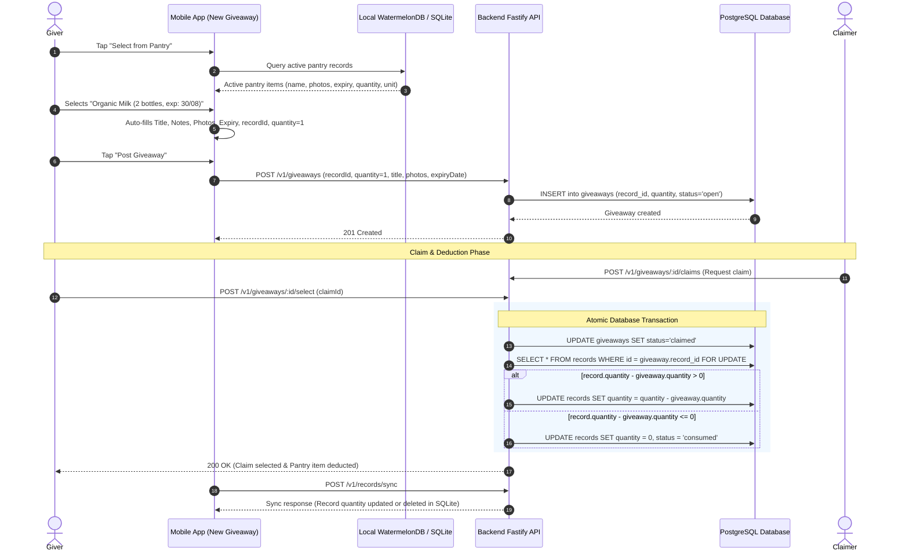

# Pantry to Giveaway Fast-Select and Quantity Sync

## Executive Summary
Users giving away pantry or grocery items often duplicate manual data entry (capturing photos, typing titles, entering expiration dates, and writing notes) that already exist in their personal or household pantry. This implementation introduces:
1. **Pantry Fast-Select Sheet (`PantrySelectModal`)**: A bottom sheet modal on the "Share an Item" creation screen letting users browse and select an existing pantry record with 1 tap, automatically filling photos, title, description/notes, item expiration date, and linking `recordId` / `productId`.
2. **Giveaway Quantity Tracking**: Optional giveaway quantity (default 1, capped at the pantry item's available quantity) with explicit unit representation (`pcs`, `pack`, `can`, `box`, etc.).
3. **Atomic Claim-Time Quantity Deduction & Record Removal**: When a giveaway is claimed (`status = 'claimed'` via `POST /giveaways/:id/select`), the linked pantry record's quantity in PostgreSQL is atomically decremented by the giveaway quantity inside a database transaction (`record.quantity - giveaway.quantity`). If the remaining quantity reaches `<= 0`, the record is marked as `consumed` (or removed).
4. **Seamless WatermelonDB Synchronization**: On next sync (`POST /v1/records/sync`), the updated or consumed record syncs back to the user's mobile SQLite database automatically.

---

## Architecture & Data Flow

---

## Phases Overview

| Phase | Name | Scope | Key Deliverables | Status |
|---|---|---|---|---|
| 1 | [Contracts](./phase-01-contracts.md) | `@expyrico/shared` | `giveawayCreateSchema`, `giveawayPatchSchema`, `giveawaySchema` quantity fields and record link contracts | Pending |
| 2 | [Backend](./phase-02-backend.md) | `api` | PostgreSQL schema migration for `quantity`, transaction-safe claim deduction logic, and test factories | Pending |
| 3 | [MobileUI](./phase-03-mobileui.md) | `apps/mobile` | `PantrySelectModal`, fast auto-fill in `new.tsx`, quantity controls, and WatermelonDB sync integration | Pending |
| 4 | [Verification](./phase-04-verification.md) | Monorepo | Integration tests, mobile unit tests, end-to-end claim deduction verification, and typechecks | Pending |

---

## Critical Invariants & Security Mandates

1. **Authorization Guard**: When `input.recordId` is supplied during giveaway creation, the backend MUST verify that `record.userId === req.user.id` (or user is a member of the record's household), throwing a 403 Forbidden otherwise.
2. **Quantity Bounds**: `giveaway.quantity` must be a positive integer (`min(1)`), and when created from a record, cannot exceed the current available `record.quantity`.
3. **Concurrency & Race Condition Safety**: Claim selection (`POST /giveaways/:id/select`) MUST execute the giveaway status change and record quantity deduction inside a single `prisma.$transaction` using row-level locking (`SELECT ... FOR UPDATE` or optimistic atomic decrement) to prevent balance race exploits.
4. **Idempotency & Rollback Safety**: If a claimed giveaway is subsequently cancelled or rejected before handoff, quantity restoration or status transitions must adhere to deterministic state rules.
5. **Zero-Friction Offline/Local Sync**: Mobile client must leverage existing WatermelonDB local record stores so selecting a pantry item works instantly even with poor connectivity.
