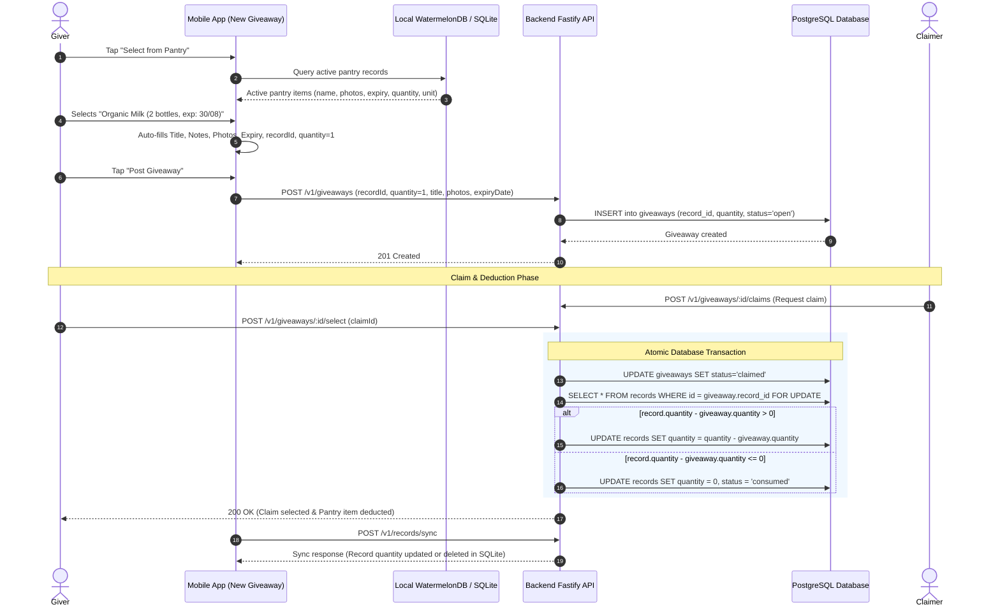

# Pantry to Giveaway Fast-Select and Quantity Sync

## Executive Summary
Users giving away pantry or grocery items often duplicate manual data entry (capturing photos, typing titles, entering expiration dates, and writing notes) that already exist in their personal or household pantry. This implementation introduces:
1. **Pantry Fast-Select Sheet (`PantrySelectModal`)**: A bottom sheet modal on the "Share an Item" creation screen letting users browse and select an existing pantry record with 1 tap, automatically filling photos, title, description/notes, item expiration date, and linking `recordId` / `productId`.
2. **Giveaway Quantity Tracking**: Optional giveaway quantity (default 1, capped at the pantry item's available quantity) with explicit unit representation (`pcs`, `pack`, `can`, `box`, etc.).
3. **Atomic Claim-Time Quantity Deduction & Record Removal**: When a giveaway is claimed (`status = 'claimed'` via `POST /giveaways/:id/select`), the linked pantry record's quantity in PostgreSQL is atomically decremented by the giveaway quantity inside a database transaction (`record.quantity - giveaway.quantity`). If the remaining quantity reaches `<= 0`, the record is marked as `consumed` (or removed).
4. **Seamless WatermelonDB Synchronization**: On next sync (`POST /v1/records/sync`), the updated or consumed record syncs back to the user's mobile SQLite database automatically.

---

## Architecture & Data Flow

---

## Phases Overview

| Phase | Name | Scope | Key Deliverables | Status |
|---|---|---|---|---|
| 1 | [Contracts](./phase-01-contracts.md) | `@expyrico/shared` | `giveawayCreateSchema`, `giveawayPatchSchema`, `giveawaySchema` quantity fields and record link contracts | Pending |
| 2 | [Backend](./phase-02-backend.md) | `api` | PostgreSQL schema migration for `quantity`, transaction-safe claim deduction logic, and test factories | Pending |
| 3 | [MobileUI](./phase-03-mobileui.md) | `apps/mobile` | `PantrySelectModal`, fast auto-fill in `new.tsx`, quantity controls, and WatermelonDB sync integration | Pending |
| 4 | [Verification](./phase-04-verification.md) | Monorepo | Integration tests, mobile unit tests, end-to-end claim deduction verification, and typechecks | Pending |

---

## Critical Invariants & Security Mandates

1. **Authorization Guard**: When `input.recordId` is supplied during giveaway creation, the backend MUST call `assertCanWriteRecord(record, req.user.id)` to verify personal ownership or active household membership, throwing 404/403 without leaking existence.
2. **Quantity Bounds & Decimal Support**: `giveaway.quantity` supports positive numbers (`z.coerce.number().positive().max(100_000)`), compatible with decimal units (`0.5 kg`, `1.5 l`), and cannot exceed the available `record.quantity`.
3. **Concurrency & Race Condition Safety**: Claim selection (`POST /giveaways/:id/select`) MUST execute the giveaway status change and record quantity deduction inside a single `prisma.$transaction` using row-level locking or optimistic atomic constraints to prevent negative quantity race conditions.
4. **Resilient Lifecycle & Rollback Safety**: If a claimed giveaway is cancelled before handoff, quantity is safely restored to the record if present. If the record was deleted prior to claim/cancellation, operations proceed gracefully.
5. **Zero-Friction Offline/Local Sync**: Mobile client queries local WatermelonDB records so selecting a pantry item works instantly even offline.

---

## Red Team Review

### Session — 2026-08-26
**Findings:** 5 (5 accepted, 0 rejected)  
**Severity breakdown:** 1 Critical, 3 High, 1 Medium  

| # | Finding | Severity | Disposition | Applied To |
|---|---------|----------|-------------|------------|
| 1 | Household Record Authorization Guard Bypass | High | Accept | Phase 2 (`create.ts`, `assertCanWriteRecord`) |
| 2 | Decimal Quantity Incompatibility (`kg`, `l`) | Critical | Accept | Phase 1 & Phase 2 (`z.coerce.number().positive()`, `DOUBLE PRECISION`) |
| 3 | Pre-Claim Consumption/Deletion Edge Case | High | Accept | Phase 2 (`select.ts`) |
| 4 | Cancellation Quantity Restoration on Deleted Record | Medium | Accept | Phase 2 (`cancel.ts`) |
| 5 | Atomic Quantity Decrement & Concurrency Guard | High | Accept | Phase 2 (`select.ts`) |

### Whole-Plan Consistency Sweep
- Reconciled decimal quantities across Phase 1 (`packages/shared`), Phase 2 (`api`), and Phase 3 (`apps/mobile`).
- Updated `create.ts` authorization guard to use `assertCanWriteRecord`.
- Confirmed zero unresolved contradictions across `plan.md` and all 4 phase documents.
