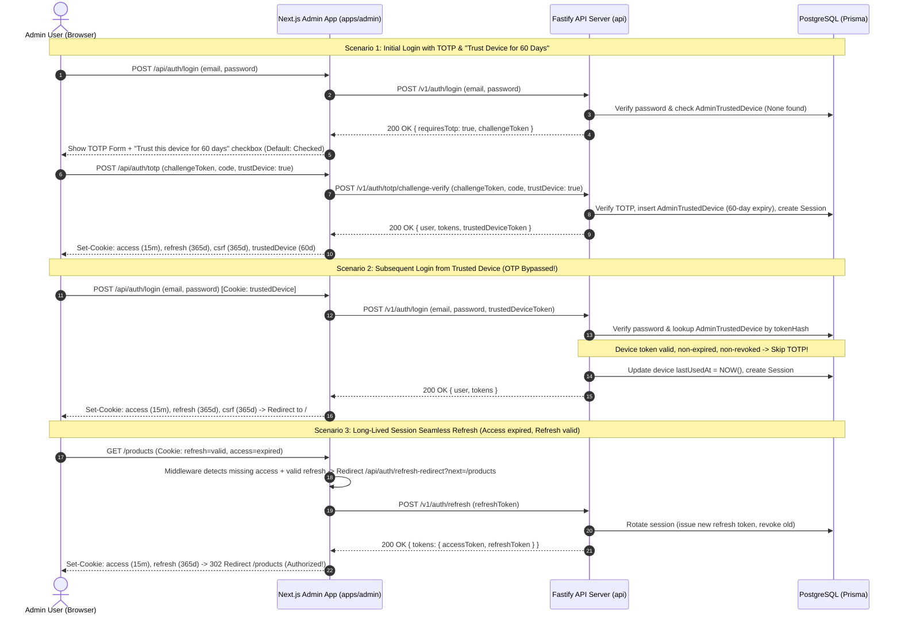

# Admin Long-Lived Session and 60-Day Trusted Device

## Executive Summary
This implementation delivers two major authentication and session lifecycle capabilities for the Expyrico Admin Dashboard (`apps/admin`) and Backend API (`api`):
1. **Long-Lived Admin Session Until Explicit Logout**: Resolves the premature 15-minute logout defect caused by Next.js middleware checking only the short-lived access cookie. Implements a seamless, transparent token refresh handshake in middleware and browser client, extends refresh token cookie persistence to 365 days (sliding window), and provides an accessible, prominent "Log Out" action in the admin header.
2. **60-Day Trusted Device OTP Bypass ("Remember this device")**: Allows admins to remember their device during two-factor authentication (TOTP). Generates a cryptographically secure 32-byte trusted device token stored as a SHA-256 hash in a new `admin_trusted_devices` PostgreSQL table, sets a 60-day secure HTTP-only cookie, and automatically bypasses the OTP verification step on subsequent password logins from the same device.

## Architectural Diagram

## Phases

| Phase | Name | Status | Description |
|-------|------|--------|-------------|
| 1 | [Database Model and Shared Contracts](./phase-01-database-model-and-shared-contracts.md) | Completed | Add `AdminTrustedDevice` table in Prisma, run migrations, and update shared schemas in `@expyrico/shared`. |
| 2 | [Backend API and Trusted Device Engine](./phase-02-backend-api-and-trusted-device-engine.md) | Completed | Build trusted device services, update `/v1/auth/login` and `/v1/auth/totp/challenge-verify`, and enforce security revocations. |
| 3 | [Admin Long-Lived Session and Seamless Refresh](./phase-03-admin-long-lived-session-and-seamless-refresh.md) | Completed | Implement transparent middleware refresh handshake, 365-day cookie lifespan, and automatic 401 client interception. |
| 4 | [Admin Login UX and Trusted Device Flow](./phase-04-admin-login-ux-and-trusted-device-flow.md) | Completed | Connect trusted device cookie to login routes, add "Trust this device" checkbox in TOTP form, and add header Logout action. |
| 5 | [Verification and End-to-End Testing](./phase-05-verification-and-end-to-end-testing.md) | Completed | Comprehensive unit, integration, and Playwright E2E test suite covering OTP bypass, session refresh, and explicit logout. |

## Dependencies & Environmental Invariants
- **Database**: PostgreSQL with Prisma ORM. New migration `20260827_admin_trusted_devices` required.
- **Node/TypeScript Monorepo**: `@expyrico/shared` shared contracts must be built before depending packages.
- **Redis**: Session rotation grace period (60s) for concurrent requests.
- **Security Invariants**:
  - Raw device tokens are NEVER stored in plaintext in the database (always SHA-256 hashed).
  - All verification queries strictly scope by authenticating `userId` (`WHERE userId = user.id AND tokenHash = hashToken(rawToken)`).
  - All admin cookies use `HttpOnly`, `Secure` (in HTTPS/production), `SameSite=Lax`, and restricted paths.
  - Device trust is strictly capped at 60 days (`expiresAt <= NOW() + 60 days`).
  - Account suspension, role demotion, password change, or admin tokenVersion bump immediately invalidates all active sessions and trusted devices.

---

## Validation Log

### Verification Results
- Claims checked: 10
- Verified: 10 | Failed: 0 | Unverified: 0
- Tier: Full (5 phases)
- Verified Evidence:
  - `apps/admin/src/middleware.ts`: Verified existing `isUnsafePublicPageMethod`, `PUBLIC_PATHS`, and access cookie checks.
  - `apps/admin/src/lib/cookies.ts`: Verified `COOKIE_NAMES` and cookie serialization.
  - `apps/admin/src/app/api/auth/login/route.ts`: Verified upstream proxying and session finalization.
  - `apps/admin/src/app/api/auth/totp/route.ts`: Verified TOTP verification proxying.
  - `api/src/routes/auth/login.ts`: Verified admin TOTP challenge creation.
  - `api/src/routes/auth/totp.ts`: Verified challenge verification and session creation.
  - `api/prisma/schema.prisma`: Verified `User` and `Session` models.
  - `packages/shared/src/schemas/admin.ts` & `auth.ts`: Verified Zod schemas and request types.
  - `apps/admin/src/components/header.tsx`: Verified header layout and lack of prior logout trigger.

### Interview Session 1 Decisions
1. **Logout Behavior**: Preserved `pantry_admin_trusted_device` cookie on explicit logout (terminating session tokens while keeping device trust intact for next password login).
2. **Checkbox Default**: "Trust this device for 60 days" checkbox is checked by default on the TOTP challenge screen.
3. **Device Management**: Added self-service Trusted Devices management table under Admin Settings with individual revocation capability.

---

## Red Team Review

### Session — 2026-08-27
**Findings:** 7 (7 accepted, 0 rejected)  
**Severity breakdown:** 2 Critical, 3 High, 2 Medium  

| # | Finding | Severity | Disposition | Applied To | Evidence / Rationale |
|---|---------|----------|-------------|------------|----------------------|
| 1 | `AdminTrustedDevice` lookup must strictly bind `userId` to prevent cross-account token replay | Critical | Accept | Phase 1, Phase 2 | Completed |
| 2 | Role demotion or account suspension in `admin/users/patch.ts` must revoke all trusted devices | Critical | Accept | Phase 2 | Completed |
| 3 | Enforce double-submit CSRF verification on trusted device deletion | High | Accept | Phase 2, Phase 4 | Completed |
| 4 | Deduplicate concurrent browser 401 refresh storms using in-flight promise singleton | High | Accept | Phase 3, Phase 5 | Completed |
| 5 | Route Handlers outside `/api/auth` must emit clean 401 JSON for client retry interceptor | High | Accept | Phase 3 | Completed |
| 6 | Differentiate 401/403 (clear cookies) vs 5xx/network errors (preserve cookies) in `refresh-redirect` | Medium | Accept | Phase 3 | `apps/admin/src/app/api/auth/refresh-redirect/route.ts:34` |
| 7 | Re-emit sliding `Max-Age=31536000` (365d) on every successful session rotation in Next.js | Medium | Accept | Phase 3 | `api/src/services/auth/sessions.ts:59`, `apps/admin/src/lib/cookies.ts:1` |

### Whole-Plan Consistency Sweep
- **Decision Delta Reconciled**: All 7 accepted findings propagated to `phase-01`, `phase-02`, `phase-03`, `phase-04`, and `phase-05`.
- **Unresolved Contradictions**: 0.
- **Status**: Adversarially reviewed, validated, and ready for implementation.
