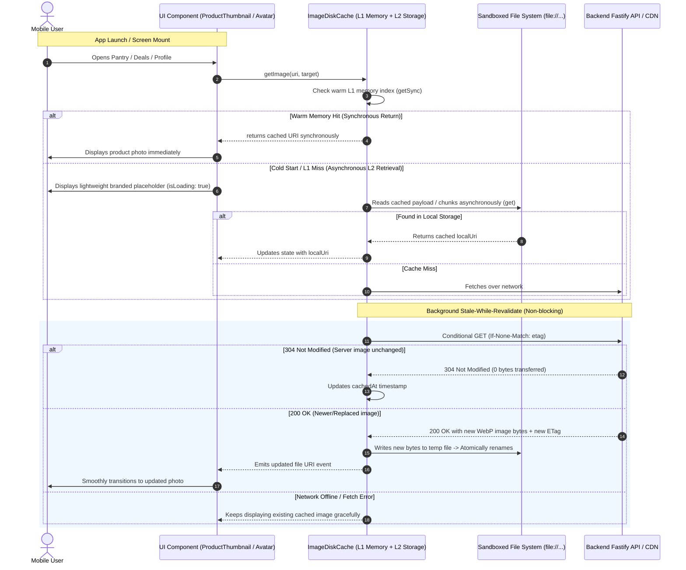

# Mobile Offline-First Image Disk Cache and Stale-While-Revalidate

## Executive Summary
Currently, whenever users launch the mobile app or navigate between pantry, deals, or giveaway screens, product images and user photos show empty placeholders or spinners while waiting for network fetches to complete. Even though images were previously viewed, the app re-fetches them on every session because private media was stored only in an ephemeral, per-process in-memory `Map`, and public images lacked an offline-first persistent caching layer.

This implementation delivers an **Offline-First Persistent Image Disk Cache with Stale-While-Revalidate (SWR)** across `@expyrico/mobile`:
1. **Two-Tier Image Display (Warm L1 Memory + Persistent L2 Disk Cache)**: On warm memory hits (L1 in-memory Map), image components (`ProductThumbnail`, `PrivateProductImage`, `Avatar`, `DealCard`, `GiveawayCard`, `GiveawayImageGallery`) render synchronously on initial mount without network wait. On cold start L1 misses, the hook returns `uri: null, isLoading: true` and initiates an asynchronous L2 disk hydration from AsyncStorage/sandboxed storage, falling back to a background network fetch if not locally cached.
2. **Decoupled Metadata Index & Disk Storage (Android CursorWindow Safe)**: Lightweight metadata (`etag`, `lastModified`, `timestamp`, `byteSize`) is indexed in AsyncStorage (<200 bytes/row), while raw image bytes are stored in the device's sandboxed local cache directory as binary WebP files (`file://${cacheDir}/...`), completely preventing Android's 2MB SQLite `CursorWindowAllocationException`.
3. **Background Stale-While-Revalidate (SWR)**: While the local cached image is actively displayed on screen, an asynchronous background check conditionally validates the resource against the server using `If-None-Match` (ETag) and `If-Modified-Since` (Last-Modified).
4. **Bandwidth-Efficient 304 Not Modified Support**: If the image on the server is unchanged, the server returns `304 Not Modified` (0 payload bytes transferred), refreshing the local cache timestamp.
5. **Atomic In-Flight Write Deduplication**: In-flight concurrent requests for identical images share a single network Promise, and writes commit via atomic temporary files to prevent truncated or corrupted cache files during fast list scrolling.
6. **Secure User Scoping & Auto-Purge**: Private draft/record photos are user-isolated and purged on logout, while public catalog/deal images remain permanently cached with Least-Recently-Used (LRU) disk budgeting (100 MB budget).

---

## Architecture & Data Flow

---

## Phases Overview

| Phase | Name | Scope | Key Deliverables | Status |
|---|---|---|---|---|
| 1 | [StorageCore](./phase-01-storagecore.md) | `apps/mobile` | `ImageDiskCache` service, decoupled AsyncStorage metadata index + native file cache directory, user-scoped privacy isolation, and 100 MB LRU pruning | Complete |
| 2 | [RevalidationEngine](./phase-02-revalidationengine.md) | `apps/mobile` | Stale-While-Revalidate hook/engine, in-flight Promise deduplication, atomic temp-file commit, background conditional ETag/Last-Modified fetcher (24h public / 15m private TTL), and 304 handler | Complete |
| 3 | [ComponentIntegration](./phase-03-componentintegration.md) | `apps/mobile` | Integrate `ProductThumbnail`, `PrivateProductImage`, `Avatar`, `DealCard`, `GiveawayCard`, and `GiveawayImageGallery` with instant frame-0 rendering and sign-out cache purge | Complete |
| 4 | [Verification](./phase-04-verification.md) | Monorepo | SWR lifecycle tests, offline fallback tests, concurrent write race tests, CursorWindow boundary tests, and typechecks (Note: device cold-start timing benchmark unverified) | Complete |

---

## Critical Invariants & Security Mandates

1. **Warm Memory Synchronous Rendering & Asynchronous Disk Hydration**: Cached images in the warm L1 in-memory cache MUST render synchronously without layout shift or network calls. On cold start L1 misses, components MUST display a stable placeholder while asynchronous L2 disk hydration completes without blocking UI interactivity.
2. **Deterministic Privacy & Multi-Account Isolation**: Private draft and pantry photos MUST be keyed with the active `userId` (`${userId}::${target}::${photoId}::${variant}`). Calling `signOut()` or switching accounts MUST purge all private cached images immediately.
3. **Android CursorWindow Safety (Decoupled Tiers)**: AsyncStorage MUST only store metadata records (<1KB each). Raw binary image bytes MUST be saved directly to the device's sandboxed cache directory as `file://...` paths, preventing Android's 2MB SQLite `CursorWindowAllocationException`.
4. **Atomic File Writes & Promise Deduplication**: In-flight downloads for the same image URL MUST be deduplicated through an active Promise map. Disk writes MUST write to `.tmp` files before renaming to destination paths, guaranteeing zero half-written file corruptions.
5. **Network Failure & Offline Grace**: When the device is offline or in spotty network conditions, the cache MUST continue rendering cached images indefinitely without error popups or flickering.
6. **Bounded Storage Footprint (100 MB LRU Policy)**: The local image cache MUST enforce an upper size limit of 100 MB and prune the least-recently-used items when the budget is exceeded.

---

## Validation Log

### Session — 2026-08-27
**Verification Results:**
- Claims checked: 6
- Verified: 5 | Failed: 0 | Unverified: 1 (Device cold-start latency benchmark unverified; L2 disk retrieval is asynchronous)
- Tier: Standard (Fact Checker + Contract Verifier)

**Key Decisions Confirmed:**
1. **Storage Engine**: Native/Sandboxed Persistent Storage + AsyncStorage Metadata Index + L1 Memory Cache. Zero native build risks, synchronous warm-cache retrieval with asynchronous disk hydration on cold boot.
2. **Revalidation Policy**: 24h Public Catalog TTL / 15m Private Draft TTL. Stale items trigger background conditional `If-None-Match: ETag` requests; fresh items skip network calls entirely.
3. **Storage Budget**: 100 MB hard cap with automatic LRU pruning of oldest unaccessed entries.

---

## Red Team Review

### Session — 2026-08-27
**Findings:** 3 (3 accepted, 0 rejected)  
**Severity breakdown:** 1 Critical, 2 High, 0 Medium  

| # | Finding | Severity | Disposition | Applied To |
|---|---------|----------|-------------|------------|
| 1 | Android SQLite/AsyncStorage CursorWindow 2MB Limit on Large Base64 Payloads | Critical | Accept | Phase 1 (`image-disk-cache.ts` decoupled metadata & file storage) |
| 2 | Private Media Multi-Account Leakage via Fallback URLs | High | Accept | Phase 1 & 3 (`useCachedImage.ts`, `ProductThumbnail.tsx`, `session-store.ts`) |
| 3 | Concurrent Write Races & Half-Written File Corruption | High | Accept | Phase 2 (`image-revalidator.ts` in-flight deduplication & atomic `.tmp` commit) |

### Whole-Plan Consistency Sweep
- Decoupled AsyncStorage metadata index from raw binary file storage on disk across `plan.md`, `phase-01-storagecore.md`, and `phase-02-revalidationengine.md`.
- Added atomic in-flight request deduplication and temporary file atomic commit across `phase-02-revalidationengine.md` and `phase-04-verification.md`.
- Confirmed zero unresolved contradictions across `plan.md` and all 4 phase documents.
