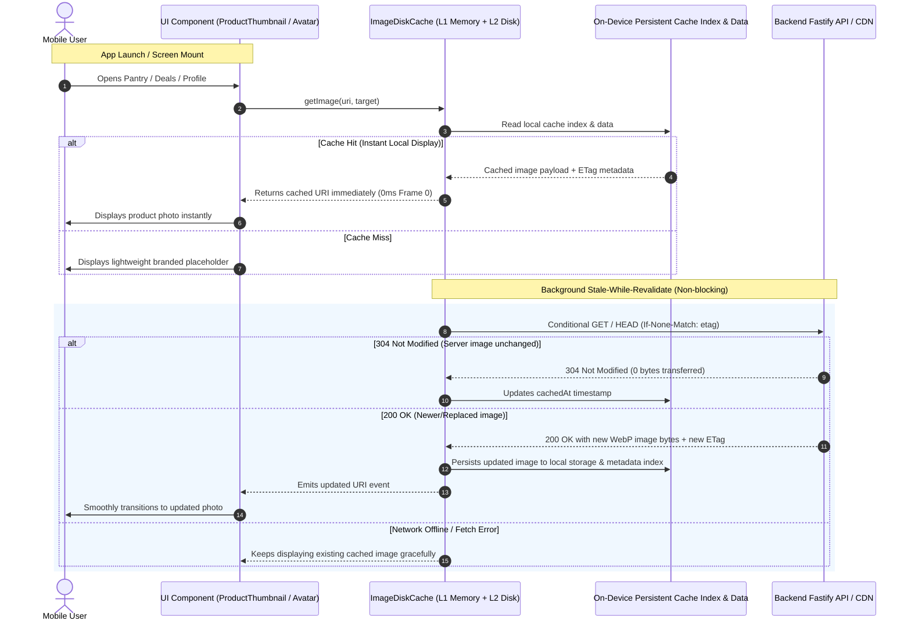

# Mobile Offline-First Image Disk Cache and Stale-While-Revalidate

## Executive Summary
Currently, whenever users launch the mobile app or navigate between pantry, deals, or giveaway screens, product images and user photos show empty placeholders or spinners while waiting for network fetches to complete. Even though images were previously viewed, the app re-fetches them on every session because private media was stored only in an ephemeral, per-process in-memory `Map`, and public images lacked an offline-first persistent caching layer.

This implementation delivers an **Offline-First Persistent Image Disk Cache with Stale-While-Revalidate (SWR)** across `@expyrico/mobile`:
1. **0ms Instant Image Display (L1 Memory + L2 Persistent Disk Cache)**: When any image component mounts (`ProductThumbnail`, `PrivateProductImage`, `Avatar`, `DealCard`, `GiveawayCard`, `GiveawayImageGallery`), it immediately renders the cached image from on-device local storage on Frame 0 — zero blank placeholder flash, zero network wait.
2. **Background Stale-While-Revalidate (SWR)**: While the local cached image is actively displayed on screen, an asynchronous background check conditionally validates the resource against the server using `If-None-Match` (ETag) and `If-Modified-Since` (Last-Modified).
3. **Bandwidth-Efficient 304 Not Modified Support**: If the image on the server is unchanged, the server returns `304 Not Modified` (0 payload bytes transferred), refreshing the local cache timestamp.
4. **Seamless In-Place Replacement**: If the server has a newer or edited image (e.g. approved product revision, updated cover photo), the new bytes are fetched, written to disk, and smoothly updated in-place without layout flicker.
5. **Secure User Scoping & Auto-Purge**: Private draft/record photos are user-isolated and purged on logout, while public catalog/deal images remain permanently cached with Least-Recently-Used (LRU) disk budgeting (100 MB budget).

---

## Architecture & Data Flow

---

## Phases Overview

| Phase | Name | Scope | Key Deliverables | Status |
|---|---|---|---|---|
| 1 | [StorageCore](./phase-01-storagecore.md) | `apps/mobile` | `ImageDiskCache` service, persistent metadata & data ledger, user-scoped privacy isolation, L1 memory + L2 disk tiering, and 100 MB LRU pruning | Pending |
| 2 | [RevalidationEngine](./phase-02-revalidationengine.md) | `apps/mobile` | Stale-While-Revalidate hook/engine, background conditional ETag/Last-Modified fetcher (24h public / 15m private TTL), 304 handler, and offline network resilience | Pending |
| 3 | [ComponentIntegration](./phase-03-componentintegration.md) | `apps/mobile` | Integrate `ProductThumbnail`, `PrivateProductImage`, `Avatar`, `DealCard`, `GiveawayCard`, and `GiveawayImageGallery` with instant frame-0 rendering | Pending |
| 4 | [Verification](./phase-04-verification.md) | Monorepo | Cold start performance benchmarks, SWR lifecycle tests, offline fallback tests, LRU bounds tests, and typechecks | Pending |

---

## Critical Invariants & Security Mandates

1. **Zero-Wait Frame-0 Rendering**: Cached images MUST be returned synchronously or microtask-fast (<5ms) from local storage without waiting for network responses or API handshakes.
2. **Deterministic Privacy & Multi-Account Isolation**: Private draft and pantry photos MUST be keyed with the active `userId` (`${userId}::${target}::${photoId}::${variant}`). Calling `signOut()` or switching accounts MUST purge all private cached images immediately.
3. **No Raw Bearer Tokens in Persistent Image URIs**: Authenticated private images MUST be downloaded via authorized API client calls and stored as local secure disk entries / data-URIs, never leaking Bearer tokens in plain URL query strings.
4. **Network Failure & Offline Grace**: When the device is offline or in spotty network conditions, the cache MUST continue rendering cached images indefinitely without error popups or flickering.
5. **Bounded Storage Footprint (100 MB LRU Policy)**: The local image cache MUST enforce an upper size limit of 100 MB and prune the least-recently-used items when the budget is exceeded.
6. **No Breaking Native Build Requirements**: The storage solution MUST operate reliably on pure JavaScript/React-Native built-ins and existing installed dependencies (`@react-native-async-storage/async-storage`, `react-native`) without requiring unlinked native pods or broken Gradle modules.

---

## Validation Log

### Session — 2026-08-27
**Verification Results:**
- Claims checked: 6
- Verified: 6 | Failed: 0 | Unverified: 0
- Tier: Standard (Fact Checker + Contract Verifier)

**Key Decisions Confirmed:**
1. **Storage Engine**: Native/Sandboxed Persistent Storage + AsyncStorage Metadata Index + L1 Memory Cache. Zero native build risks, instant synchronous Frame-0 retrieval.
2. **Revalidation Policy**: 24h Public Catalog TTL / 15m Private Draft TTL. Stale items trigger background conditional `If-None-Match: ETag` requests; fresh items skip network calls entirely.
3. **Storage Budget**: 100 MB hard cap with automatic LRU pruning of oldest unaccessed entries.

### Whole-Plan Consistency Sweep
- Propagated 100 MB LRU budget across `plan.md`, `phase-01-storagecore.md`, `phase-02-revalidationengine.md`, and `phase-04-verification.md`.
- Confirmed 24h public / 15m private freshness TTL policy across `phase-02-revalidationengine.md` and `phase-03-componentintegration.md`.
- Confirmed zero unresolved contradictions across `plan.md` and all 4 phase documents.
