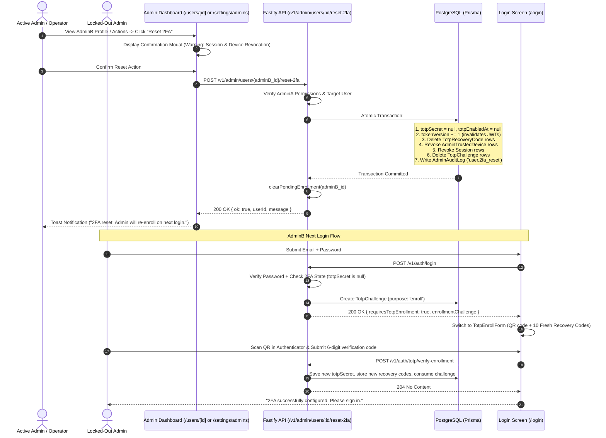

# Admin 2FA Recovery and Reset Mechanism

## Overview

In Expyrico, Two-Factor Authentication (TOTP) is strictly enforced for all Administrator accounts. During initial enrollment, an admin receives 10 single-use recovery codes. However, if an administrator loses both their authenticator device (e.g., lost phone, broken hardware) and their recovery codes, they become permanently locked out with no mechanism to regain access.

This plan designs and implements a **multi-layered, defense-in-depth 2FA recovery system**:
1. **Admin Dashboard Peer/Self 2FA Reset**: Authorized administrators can clear 2FA for another admin (or their own account) directly from the User Detail (`/users/[id]`) and Admin Settings (`/settings/admins`) consoles with explicit security confirmation and audit logging.
2. **Atomic Revocation & Token Invalidation**: A 2FA reset atomically clears TOTP secrets, deletes existing recovery codes, revokes all active sessions (`Session`), revokes 60-day trusted devices (`AdminTrustedDevice`), cancels pending challenges, and increments `tokenVersion` (immediately invalidating active JWTs).
3. **In-Memory Cache Invalidation**: Clears cached `PENDING_ENROLLMENTS` so subsequent re-enrollment generates fresh secrets.
4. **Seamless Forced Re-Enrollment Flow**: Upon subsequent email/password login, the backend detects unconfigured 2FA, issues an `enrollmentChallenge`, and directs the user to scan a fresh QR code and save 10 new recovery codes before granting access.
5. **Emergency Server-Side Disaster Recovery CLI**: A dedicated, secure CLI tool (`pnpm --filter @expyrico/api admin:reset-2fa -- --email=...`) allowing infrastructure operators to recover admin access on the host when all admin accounts are locked out.

---

## Architectural Workflow

---

## Phases Roadmap

| Phase | Name | Status | Key Deliverable |
|:-----:|------|:------:|-----------------|
| 1 | [Shared Contracts and Schemas](./phase-01-shared-contracts-and-schemas.md) | Completed | Zod schemas, types, error codes, and audit log definitions in `@expyrico/shared` |
| 2 | [Backend API and Disaster Recovery CLI](./phase-02-backend-api-and-disaster-recovery-cli.md) | Completed | Fastify reset endpoint, atomic purge transaction, in-memory cache clear, and disaster recovery CLI script |
| 3 | [Admin Console UI and Workflows](./phase-03-admin-console-ui-and-workflows.md) | Completed | Reset 2FA buttons, ActionResult handling, and confirmation modals in User Detail and Admin Settings |
| 4 | [Security Hardening and Automated Testing](./phase-04-security-hardening-and-automated-testing.md) | Completed | Integration test suite, permission boundaries, token invalidation verification, and typechecks |

---

## Key Files to Touch

### `@expyrico/shared`
- `packages/shared/src/schemas/admin/users.ts`: Add `adminUserReset2faResponseSchema` and request options.
- `packages/shared/src/constants/errors.ts`: Add `CANNOT_RESET_UNENROLLED_2FA` and related error codes.

### `api` (Backend)
- `api/src/routes/admin/users/reset-2fa.ts`: New route handler for `POST /v1/admin/users/:id/reset-2fa`.
- `api/src/routes/admin/users/index.ts`: Register the reset-2fa route.
- `api/src/routes/auth/totp.ts`: Export `clearPendingEnrollment(userId)`.
- `api/prisma/reset-admin-2fa.ts`: Dedicated disaster-recovery CLI script.
- `api/package.json`: Add `"admin:reset-2fa"` npm script with `tsx --env-file=.env`.
- `api/tests/integration/admin/users-reset-2fa.test.ts`: Complete integration test suite.

### `apps/admin` (Frontend)
- `apps/admin/src/lib/admin-api.ts`: Add `users.reset2fa(id)` client method.
- `apps/admin/src/lib/actions.ts`: Add `resetUser2faAction(id)` server action with `ActionResult<T>` and path revalidation.
- `apps/admin/src/app/(admin)/users/[id]/user-actions.tsx`: Add "Reset 2FA" action button with confirmation dialog.
- `apps/admin/src/app/(admin)/settings/admins/page.tsx`: Add Reset 2FA action to admin list.
- `apps/admin/src/app/(admin)/settings/admins/reset-admin-2fa-button.tsx`: Dedicated button component with confirmation.

---

## Red Team Review

### Session — 2026-08-28
**Findings:** 5 (5 accepted, 0 rejected)  
**Severity Breakdown:** 0 Critical, 2 High, 3 Medium  
**Review Lenses:** Security Adversary, Failure Mode Analyst, Assumption Destroyer  

| # | Finding | Severity | Disposition | Applied To |
|---|---------|----------|-------------|------------|
| 1 | In-Memory `PENDING_ENROLLMENTS` Map Can Leak Stale TOTP Secrets on Re-Enrollment | High | Accept | Completed |
| 2 | CLI Script Must Use `tsx --env-file=.env` to Match Workspace ESM Loader | Medium | Accept | Completed |
| 3 | Server Action Must Use `ActionResult<T>` Pattern for Typed Error Surfacing | High | Accept | Completed |
| 4 | Inconsistency in Admin Demotion/Revocation Route (Ensure Standalone Atomic Purge) | Medium | Accept | Completed |
| 5 | Self-Reset Guardrail & Prominent Logout UI Warning | Medium | Accept | Phase 3 (`apps/admin/src/app/(admin)/users/[id]/user-actions.tsx`) |

### Whole-Plan Consistency Sweep
- **Decision Deltas Applied:**
  - `clearPendingEnrollment` helper integrated in Phase 2 architecture, implementation steps, and success criteria.
  - Script command `"admin:reset-2fa": "tsx --env-file=.env prisma/reset-admin-2fa.ts"` validated against `api/package.json`.
  - `resetUser2faAction` return type updated to `Promise<ActionResult<AdminUserReset2faResponse>>` in Phase 3.
  - Confirmation modal UX explicitly distinguishes peer-resets from self-resets with clear logout warnings.
- **Unresolved Contradictions:** 0
- **Consistency Status:** **Verified Clean & Complete**

---

## Success Criteria
- [ ] Any active Administrator can securely reset 2FA for another admin via `/users/[id]` and `/settings/admins`.
- [ ] 2FA reset completely and atomically purges old secrets, recovery codes, active sessions, and trusted devices.
- [ ] Active JWT tokens of the affected user are immediately invalidated via `tokenVersion` bump.
- [ ] In-memory pending enrollment caches are purged.
- [ ] The affected admin is seamlessly prompted to scan a new QR code and obtain 10 fresh recovery codes upon next login.
- [ ] Server operators can run `pnpm --filter @expyrico/api admin:reset-2fa -- --email=...` for zero-dashboard disaster recovery.
- [ ] Full audit log trail is recorded for all 2FA resets.
- [ ] All automated tests pass with 100% type safety.
