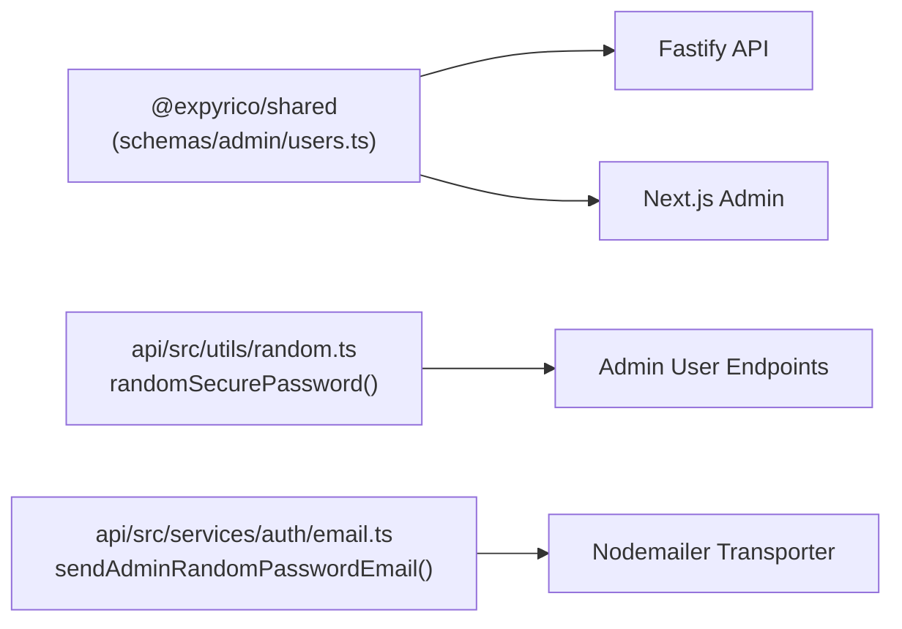

# Phase 1: Shared Schemas & Email Template

## Overview
Defines standard request and response Zod schemas in `@expyrico/shared`, implements a CSPRNG-backed password generator in `api/src/utils/random.ts`, and adds an Expyrico-branded email template for admin-issued password resets in `api/src/services/auth/email.ts`.

## Requirements
- Functional:
  - Zod schema for manual admin password change request (`passwordField`, 10–128 characters) and response.
  - Zod schema for admin random password reset email request (optional notes) and response.
  - Random password generator function `randomSecurePassword(length = 16)` producing high-entropy passwords with guaranteed character diversity (uppercase, lowercase, numbers, special symbols) avoiding ambiguous glyphs.
  - Branded HTML & plaintext email template `sendAdminRandomPasswordEmail(to, temporaryPassword)` using the Expyrico design palette.
- Non-functional:
  - 100% type safety across packages.
  - Zero dependencies on external untrusted libraries for random password generation (use native `node:crypto`).
  - Strict compliance with Expyrico email client inline styling rules (table-based layout, no external stylesheets).

## Architecture


## Related Code Files
- Modify: `packages/shared/src/schemas/admin/users.ts`
- Modify: `packages/shared/src/index.ts`
- Modify: `api/src/utils/random.ts`
- Modify: `api/src/services/auth/email.ts`
- Create / Modify: `api/tests/unit/random.test.ts`
- Modify: `api/tests/unit/auth-email.test.ts`

## Implementation Steps

1. **Add Schemas to `@expyrico/shared`**:
   In `packages/shared/src/schemas/admin/users.ts`:
   ```typescript
   import { passwordField } from '../auth.js';

   export const adminUserChangePasswordRequestSchema = z.object({
     password: passwordField,
   });
   export type AdminUserChangePasswordRequest = z.infer<typeof adminUserChangePasswordRequestSchema>;

   export const adminUserChangePasswordResponseSchema = z.object({
     ok: z.literal(true),
     userId: z.string().uuid(),
     message: z.string(),
   });
   export type AdminUserChangePasswordResponse = z.infer<typeof adminUserChangePasswordResponseSchema>;

   export const adminUserSendRandomPasswordRequestSchema = z.object({
     notes: z.string().trim().max(500).optional(),
   });
   export type AdminUserSendRandomPasswordRequest = z.infer<typeof adminUserSendRandomPasswordRequestSchema>;

   export const adminUserSendRandomPasswordResponseSchema = z.object({
     ok: z.literal(true),
     userId: z.string().uuid(),
     message: z.string(),
   });
   export type AdminUserSendRandomPasswordResponse = z.infer<typeof adminUserSendRandomPasswordResponseSchema>;
   ```
   Re-export all new schemas and types in `packages/shared/src/index.ts`.

2. **Implement `randomSecurePassword` in `api/src/utils/random.ts`**:
   ```typescript
   export function randomSecurePassword(length = 16): string {
     const upper = 'ABCDEFGHJKLMNPQRSTUVWXYZ';
     const lower = 'abcdefghijkmnopqrstuvwxyz';
     const digits = '23456789';
     const symbols = '!@#$%^&*()-_=+[]{}';
     const all = upper + lower + digits + symbols;

     // Ensure at least one from each pool
     const sample = [
       upper[randomInt(0, upper.length)],
       lower[randomInt(0, lower.length)],
       digits[randomInt(0, digits.length)],
       symbols[randomInt(0, symbols.length)],
     ];

     while (sample.length < length) {
       sample.push(all[randomInt(0, all.length)]);
     }

     // Fisher-Yates shuffle
     for (let i = sample.length - 1; i > 0; i--) {
       const j = randomInt(0, i + 1);
       [sample[i], sample[j]] = [sample[j], sample[i]];
     }

     return sample.join('');
   }
   ```

3. **Implement `sendAdminRandomPasswordEmail` in `api/src/services/auth/email.ts`**:
   - Create HTML card template using `PALETTE.primary` (`#4BAE8A`), `PALETTE.primaryLight` (`#D6F0E6`), `PALETTE.accentLight` (`#FEEFC3`), and `PALETTE.ink` (`#2C2C28`).
   - Plaintext fallback detailing that an administrator reset their password and providing the temporary password.
   - Prominent security recommendation to log in and update their password immediately.
   - Add test mock bypass when `cfg.env === 'test'`.

4. **Write Unit Tests**:
   - `api/tests/unit/random.test.ts`: Test that `randomSecurePassword` generates passwords of requested length, satisfies minimum length requirements, and includes all character classes.
   - `api/tests/unit/auth-email.test.ts`: Verify `sendAdminRandomPasswordEmail` executes without errors in test mode.

## Success Criteria
- [ ] `@expyrico/shared` builds cleanly and exports all request/response schemas.
- [ ] `randomSecurePassword()` produces a cryptographically secure, valid password meeting `passwordField` requirements.
- [ ] `sendAdminRandomPasswordEmail` handles sending cleanly with both HTML and plaintext fallbacks.
- [ ] Unit tests pass 100%.

## Risk Assessment
- *Risk*: Generated password fails validation schema.
  *Mitigation*: Default length of 16 and explicit character pool sampling guarantees length $\ge 10$ and all valid characters.
- *Risk*: Email client strips CSS styling.
  *Mitigation*: All styling is purely inline on HTML table elements following the established email service standard in `email.ts`.
