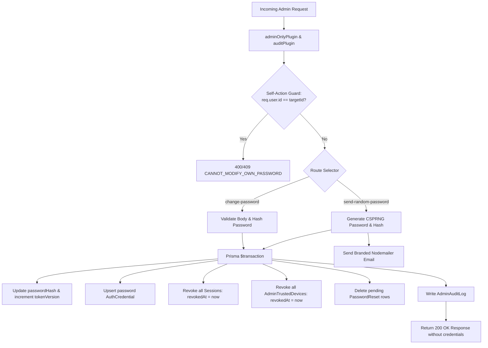

# Phase 2: API Endpoints & Security Integration

<!-- Updated: Validation Session 1 - Added Self-Action Guard (req.user.id !== id) and confirmed Email-Only response contract -->

## Overview
Implements two admin endpoints in the Fastify API: `POST /v1/admin/users/:id/change-password` for manual password updates and `POST /v1/admin/users/:id/send-random-password` for random password generation and email dispatch. Integrates atomic session and trusted device revocation, password credential upserting, self-action guards, and audit logging.

## Requirements
- Functional:
  - `POST /v1/admin/users/:id/change-password`:
    - Admin provides new password in body.
    - Self-action check: Rejects if `req.user.id === id` (admin must use `/me/password` to modify their own password).
    - Hashes with Argon2id (`hashPassword`).
    - Updates user `passwordHash`, increments `tokenVersion`.
    - Upserts `AuthCredential` (`type: 'password'`) if missing (enabling password login for OAuth-only users).
    - Revokes all active `Session` and `AdminTrustedDevice` rows (`revokedAt = now()`).
    - Audit log: `user.password_change`.
  - `POST /v1/admin/users/:id/send-random-password`:
    - Self-action check: Rejects if `req.user.id === id`.
    - Generates 16-character CSPRNG password via `randomSecurePassword()`.
    - Hashes with Argon2id (`hashPassword`).
    - Updates DB atomically with session revocation and `AuthCredential` upsert.
    - Dispatches email via `sendAdminRandomPasswordEmail(user.email, tempPassword)`.
    - Confidentiality: Does NOT return the temporary password in the HTTP response body.
    - Audit log: `user.password_reset_email`.
- Non-functional:
  - Zero plaintext passwords in audit logs, error payloads, API responses, or log traces.
  - Transactions prevent partial state update if database fails.
  - Returns 404 if user not found.
  - RBAC: 403 / 401 for non-admin callers via `adminOnlyPlugin`.

## Architecture


## Related Code Files
- Create: `api/src/routes/admin/users/change-password.ts`
- Create: `api/src/routes/admin/users/send-random-password.ts`
- Modify: `api/src/routes/admin/index.ts`
- Create: `api/tests/integration/admin/users-password.test.ts`

## Implementation Steps

1. **Create `api/src/routes/admin/users/change-password.ts`**:
   ```typescript
   import type { FastifyInstance } from 'fastify';
   import { z } from 'zod';
   import {
     adminUserChangePasswordRequestSchema,
     adminUserChangePasswordResponseSchema,
     ERROR_CODES,
   } from '@expyrico/shared';
   import { getPrisma } from '../../../db.js';
   import { AppError } from '../../../errors.js';
   import { hashPassword } from '../../../services/auth/passwords.js';

   const paramsSchema = z.object({ id: z.string().uuid() });

   export async function adminUsersChangePasswordRoute(app: FastifyInstance) {
     app.post('/:id/change-password', async (req) => {
       const { id } = paramsSchema.parse(req.params);
       const input = adminUserChangePasswordRequestSchema.parse(req.body);
       const prisma = getPrisma();

       if (req.user?.id === id) {
         throw new AppError({
           status: 400,
           code: ERROR_CODES.CONFLICT,
           title: 'Cannot change your own password from the user directory. Please use account settings.',
         });
       }

       const user = await prisma.user.findUnique({ where: { id } });
       if (!user) {
         throw new AppError({
           status: 404,
           code: ERROR_CODES.NOT_FOUND,
           title: 'User not found',
         });
       }

       const passwordHash = await hashPassword(input.password);
       const now = new Date();

       await prisma.$transaction(async (tx) => {
         await tx.user.update({
           where: { id },
           data: {
             passwordHash,
             tokenVersion: { increment: 1 },
           },
         });

         const existingCred = await tx.authCredential.findFirst({
           where: { userId: id, type: 'password' },
         });
         if (!existingCred) {
           await tx.authCredential.create({
             data: { userId: id, type: 'password' },
           });
         }

         await tx.session.updateMany({
           where: { userId: id, revokedAt: null },
           data: { revokedAt: now },
         });
         await tx.adminTrustedDevice.updateMany({
           where: { userId: id, revokedAt: null },
           data: { revokedAt: now },
         });
         await tx.passwordReset.deleteMany({
           where: { userId: id },
         });
       });

       await req.auditLog(
         'user.password_change',
         { type: 'user', id },
         {
           before: { passwordSet: user.passwordHash !== null },
           after: { passwordSet: true, method: 'manual_admin' },
         },
       );

       return adminUserChangePasswordResponseSchema.parse({
         ok: true,
         userId: id,
         message: 'Password updated successfully.',
       });
     });
   }
   ```

2. **Create `api/src/routes/admin/users/send-random-password.ts`**:
   ```typescript
   import type { FastifyInstance } from 'fastify';
   import { z } from 'zod';
   import {
     adminUserSendRandomPasswordRequestSchema,
     adminUserSendRandomPasswordResponseSchema,
     ERROR_CODES,
   } from '@expyrico/shared';
   import { getPrisma } from '../../../db.js';
   import { AppError } from '../../../errors.js';
   import { hashPassword } from '../../../services/auth/passwords.js';
   import { randomSecurePassword } from '../../../utils/random.js';
   import { sendAdminRandomPasswordEmail } from '../../../services/auth/email.js';

   const paramsSchema = z.object({ id: z.string().uuid() });

   export async function adminUsersSendRandomPasswordRoute(app: FastifyInstance) {
     app.post('/:id/send-random-password', async (req) => {
       const { id } = paramsSchema.parse(req.params);
       adminUserSendRandomPasswordRequestSchema.optional().parse(req.body ?? {});
       const prisma = getPrisma();

       if (req.user?.id === id) {
         throw new AppError({
           status: 400,
           code: ERROR_CODES.CONFLICT,
           title: 'Cannot reset your own password from the user directory. Please use account settings.',
         });
       }

       const user = await prisma.user.findUnique({ where: { id } });
       if (!user) {
         throw new AppError({
           status: 404,
           code: ERROR_CODES.NOT_FOUND,
           title: 'User not found',
         });
       }

       const tempPassword = randomSecurePassword(16);
       const passwordHash = await hashPassword(tempPassword);
       const now = new Date();

       await prisma.$transaction(async (tx) => {
         await tx.user.update({
           where: { id },
           data: {
             passwordHash,
             tokenVersion: { increment: 1 },
           },
         });

         const existingCred = await tx.authCredential.findFirst({
           where: { userId: id, type: 'password' },
         });
         if (!existingCred) {
           await tx.authCredential.create({
             data: { userId: id, type: 'password' },
           });
         }

         await tx.session.updateMany({
           where: { userId: id, revokedAt: null },
           data: { revokedAt: now },
         });
         await tx.adminTrustedDevice.updateMany({
           where: { userId: id, revokedAt: null },
           data: { revokedAt: now },
         });
         await tx.passwordReset.deleteMany({
           where: { userId: id },
         });
       });

       await sendAdminRandomPasswordEmail(user.email, tempPassword);

       await req.auditLog(
         'user.password_reset_email',
         { type: 'user', id },
         {
           before: { passwordSet: user.passwordHash !== null },
           after: { passwordSet: true, method: 'random_email' },
         },
       );

       return adminUserSendRandomPasswordResponseSchema.parse({
         ok: true,
         userId: id,
         message: 'A temporary random password has been generated and sent to the user email.',
       });
     });
   }
   ```

3. **Register Routes in `api/src/routes/admin/index.ts`**:
   Register `adminUsersChangePasswordRoute` and `adminUsersSendRandomPasswordRoute` with `{ prefix: '/users' }`.

4. **Integration Tests in `api/tests/integration/admin/users-password.test.ts`**:
   - TC-01: Admin changes user password manually with valid input.
   - TC-02: Admin self-change password returns 400 error.
   - TC-03: Password change fails with 400 when password is too short (<10 chars).
   - TC-04: Password change increments `tokenVersion` and revokes all active `Session` and `AdminTrustedDevice` rows.
   - TC-05: Non-admin caller receives 403 Forbidden.
   - TC-06: 404 for nonexistent target user.
   - TC-07: Admin sends random password email (self-reset returns 400, other user succeeds and sends email without returning password in body).
   - TC-08: Audit logs record actions without leaking credentials.

## Success Criteria
- [ ] Both endpoints enforce admin authorization and self-action guard.
- [ ] DB updates execute atomically within a transaction.
- [ ] All existing sessions and trusted devices are revoked immediately.
- [ ] Temporary password is never returned in HTTP responses.
- [ ] Integration tests pass 100%.

## Risk Assessment
- *Risk*: Self-lockout by admin accidentally resetting own password in directory.
  *Mitigation*: Guard explicitly blocks `req.user.id === id`.
