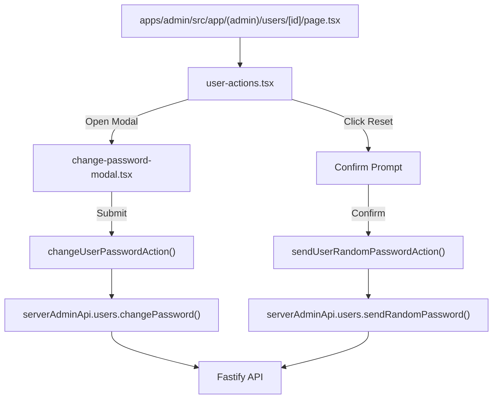

# Phase 3: Admin UI & Server Actions

<!-- Updated: Validation Session 1 - Added Self-Action UI handling on user detail page -->

## Overview
Adds admin API client methods and Next.js 15 Server Actions in `apps/admin`, creates an accessible, responsive modal dialog for manual password entry with visibility toggle and validation, and integrates the "Set password" and "Reset password & email" action triggers into the user detail page (`/users/[id]`).

## Requirements
- Functional:
  - `serverAdminApi.users.changePassword` and `serverAdminApi.users.sendRandomPassword` client methods.
  - `changeUserPasswordAction` and `sendUserRandomPasswordAction` server actions that revalidate `/users` and `/users/[id]`.
  - Accessible `ChangePasswordModal` component with:
    - New Password input with Show/Hide visibility toggle.
    - Confirm Password input.
    - Real-time client-side length check ($\ge 10$ characters) and mismatch warning.
    - Warning callout: "Setting a new password will immediately revoke all active sessions and trusted devices for this user."
    - Submit and Cancel buttons with pending state handling.
  - "Reset password & email" button with standard confirmation prompt explaining session revocation and email dispatch.
  - Clear success/error status messages displayed inline.
  - Self-Action UI Handling: If the administrator views their own profile in `/users/[id]`, the password actions display a disabled state or helpful note indicating that admins must use their personal settings (`/me/password`) to change their own password.
- Non-functional:
  - Adherence to the Expyrico palette (Fresh Sage `#4BAE8A`, Deep Sage `#3A8F6F`, Honey `#F5A623`, Stone `#F0F0ED`, Almost Black `#2C2C28`).
  - Smooth UX with `useTransition` and accessible keyboard navigation (Escape to close, Enter to submit).

## Architecture


## Related Code Files
- Modify: `apps/admin/src/lib/admin-api.ts`
- Modify: `apps/admin/src/lib/actions.ts`
- Create: `apps/admin/src/app/(admin)/users/[id]/change-password-modal.tsx`
- Modify: `apps/admin/src/app/(admin)/users/[id]/user-actions.tsx`
- Modify: `apps/admin/src/app/(admin)/users/[id]/page.tsx`

## Implementation Steps

1. **Update `apps/admin/src/lib/admin-api.ts`**:
   Add user password methods to `serverAdminApi.users`:
   ```typescript
   changePassword: (id: string, body: AdminUserChangePasswordRequest) =>
     apiServerFetch<AdminUserChangePasswordResponse>(`/v1/admin/users/${id}/change-password`, {
       method: 'POST',
       body,
     }).then((r) => adminUserChangePasswordResponseSchema.parse(r)),

   sendRandomPassword: (id: string, body?: AdminUserSendRandomPasswordRequest) =>
     apiServerFetch<AdminUserSendRandomPasswordResponse>(`/v1/admin/users/${id}/send-random-password`, {
       method: 'POST',
       body,
     }).then((r) => adminUserSendRandomPasswordResponseSchema.parse(r)),
   ```

2. **Update `apps/admin/src/lib/actions.ts`**:
   Add Server Actions:
   ```typescript
   export async function changeUserPasswordAction(
     id: string,
     body: AdminUserChangePasswordRequest,
   ): Promise<ActionResult<AdminUserChangePasswordResponse>> {
     const result = await runAction(() => serverAdminApi.users.changePassword(id, body));
     if (result.ok) {
       revalidatePath('/users');
       revalidatePath(`/users/${id}`);
     }
     return result;
   }

   export async function sendUserRandomPasswordAction(
     id: string,
     body?: AdminUserSendRandomPasswordRequest,
   ): Promise<ActionResult<AdminUserSendRandomPasswordResponse>> {
     const result = await runAction(() => serverAdminApi.users.sendRandomPassword(id, body));
     if (result.ok) {
       revalidatePath('/users');
       revalidatePath(`/users/${id}`);
     }
     return result;
   }
   ```

3. **Create `apps/admin/src/app/(admin)/users/[id]/change-password-modal.tsx`**:
   Implement an overlay modal dialog:
   - State for `password`, `confirmPassword`, `showPassword`, `pending`, `err`.
   - Client-side validation: ensures password length $\ge 10$ and matches confirm password before dispatching.
   - Calls `changeUserPasswordAction(userId, { password })`.
   - On success, invokes `onSuccess(message)` and closes the modal.
   - Clean, accessible styling matching Expyrico design guidelines.

4. **Integrate into `apps/admin/src/app/(admin)/users/[id]/user-actions.tsx`**:
   - Add a key icon ($\text{🔑}$) "Set password" button that toggles `ChangePasswordModal`.
   - Add a mail icon ($\text{✉️}$) "Reset password & email" button that triggers `sendUserRandomPasswordAction` after confirmation.
   - If the viewing admin is on their own account (`isSelf = true`), disable password buttons or provide tooltip.
   - Display returned status/feedback message directly in the action bar.

## Success Criteria
- [ ] Administrator can open modal and manually enter a new password for any other user.
- [ ] Client validation prevents submitting passwords shorter than 10 characters or mismatched confirmation.
- [ ] Administrator can trigger a random password reset email with one confirmation click.
- [ ] Status updates and error messages are rendered clearly in the UI.

## Risk Assessment
- *Risk*: Accidental admin password reset without confirmation.
  *Mitigation*: Modal confirmation required for manual change; `window.confirm` or modal prompt required for email reset.
- *Risk*: Inconsistent styling with the rest of the admin console.
  *Mitigation*: Reuses `@/components/ui/button`, `@/components/ui/input`, and Expyrico Tailwind color variables.
