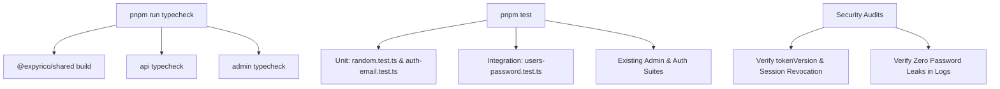

# Phase 4: Verification & Testing

## Overview
Comprehensive quality verification across packages: TypeScript typechecks, unit testing for crypto & email utilities, end-to-end integration tests for API endpoints & database state mutations, and manual verification of the Admin UI workflow.

## Requirements
- Functional:
  - Verify that manual password change allows user login with the newly set password.
  - Verify that random password generation creates a functional credential that allows user login.
  - Verify that outstanding access tokens (issued before password change) are rejected due to `tokenVersion` mismatch.
  - Verify that outstanding refresh sessions and trusted devices are revoked.
  - Verify that audit logs contain correct action types (`user.password_change`, `user.password_reset_email`) and target IDs.
- Non-functional:
  - Zero TypeScript compiler errors across `@expyrico/shared`, `@expyrico/api`, and `@expyrico/admin`.
  - Zero regression in existing test suites.

## Architecture


## Related Code Files
- Test: `api/tests/unit/random.test.ts`
- Test: `api/tests/unit/auth-email.test.ts`
- Test: `api/tests/integration/admin/users-password.test.ts`
- Verification Commands: `package.json` scripts across packages

## Implementation Steps

1. **Monorepo Build & Typecheck**:
   ```bash
   pnpm --filter @expyrico/shared build
   pnpm --filter @expyrico/api typecheck
   pnpm --filter @expyrico/admin typecheck
   ```

2. **Run Unit Tests**:
   ```bash
   pnpm --filter @expyrico/api test api/tests/unit/random.test.ts
   pnpm --filter @expyrico/api test api/tests/unit/auth-email.test.ts
   ```

3. **Run API Integration Tests**:
   ```bash
   pnpm --filter @expyrico/api test api/tests/integration/admin/users-password.test.ts
   pnpm --filter @expyrico/api test api/tests/integration/admin/users.test.ts
   ```

4. **Verify Session Invalidation & Re-Authentication**:
   - Issue JWT token with `tokenVersion = 0`.
   - Admin changes password $\rightarrow$ `tokenVersion` becomes 1.
   - Calling `/auth/me` with old token returns 401 Unauthorized.
   - Calling `/auth/login` with new password returns 200 OK and fresh tokens.

5. **Verify Audit Log Integrity**:
   - Inspect `admin_audit_logs` table after mutations.
   - Verify `action` is recorded without any plaintext password or hash in `diff`.

## Success Criteria
- [ ] All TypeScript typechecks pass with zero errors.
- [ ] All unit and integration tests pass with 100% green status.
- [ ] Session invalidation functions as expected across JWTs and refresh sessions.
- [ ] Plaintext passwords never leak in logs, database diffs, or API responses.

## Risk Assessment
- *Risk*: Database transactions fail or lock in concurrent scenarios.
  *Mitigation*: Hashing is done outside the transaction; transaction only contains single-row updates and index lookups.
