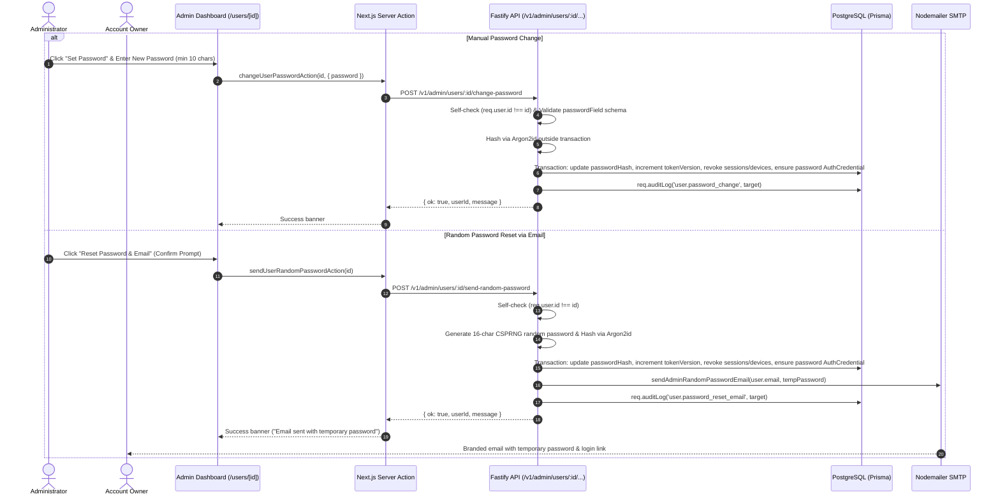

# Admin User Manual Password Change and Random Password Reset Email

## Executive Summary

Customer support and administrator workflows frequently require resetting or overriding credentials for locked-out, compromised, or transitioning user accounts. Currently, the admin console supports suspending users, revoking sessions, resetting 2FA, and impersonation, but lacks a direct mechanism for administrators to:
1. **Manually change/set a user's password** directly in the admin console.
2. **Generate a cryptographically secure random password and dispatch it via email** to the user with a single click.

This plan introduces end-to-end support across `@expyrico/shared`, `api` (Fastify + Prisma + PostgreSQL + Nodemailer), and `apps/admin` (Next.js 15 Server Actions & React UI) with defense-in-depth security:
- **Argon2id KDF hashing** before persisting credentials.
- **Atomic session & trusted device revocation** by incrementing `tokenVersion` and timestamping `revokedAt` on all active sessions and trusted devices.
- **OAuth fallback support**: Automatically creates a `password` `AuthCredential` if the user originally signed up via Google/Apple OAuth without a password.
- **Branded, responsive email template** adhering to the Expyrico design palette (`#4BAE8A`, `#3A8F6F`, `#D6F0E6`, `#FAFAF8`).
- **Comprehensive audit logging**: Records admin ID, target user ID, and method without logging plaintext or hashed credentials.
- **Self-Action Guard**: Blocks self-password modification in the admin user directory (`/users/[id]`), preventing accidental self-revocation and directing admins to account settings (`/me/password`).

---

## Architectural Flow

---

## Phases

| Phase | Name | Description | Status |
|---|---|---|---|
| 1 | [Shared Schemas & Email Template](./phase-01-shared-schemas-email-template.md) | Zod request/response contracts, CSPRNG password generator, and branded email template. | Completed |
| 2 | [API Endpoints & Security Integration](./phase-02-api-endpoints-security-integration.md) | Fastify routes, Prisma transactional revocation, audit logs, and integration tests. | Completed |
| 3 | [Admin UI & Server Actions](./phase-03-admin-ui-server-actions.md) | Server actions, admin API client, modal dialog for manual password entry, and one-click email reset button. | Completed |
| 4 | [Verification & Testing](./phase-04-verification-testing.md) | Typecheck, unit tests, integration test suite, and session revocation verification. | Completed |

---

## Validation Log

### Verification Results
- **Claims checked**: 11
- **Verified**: 11 | **Failed**: 0 | **Unverified**: 0
- **Tier**: Standard (Fact Checker + Contract Verifier)
- **Verified Evidence**:
  - `packages/shared/src/schemas/admin/users.ts`: Verified existing admin schema patterns.
  - `api/src/services/auth/passwords.ts`: Verified `hashPassword` (Argon2id).
  - `api/src/services/auth/email.ts`: Verified brand palette and nodemailer transport.
  - `api/src/utils/random.ts`: Verified crypto token utilities.
  - `api/src/routes/admin/index.ts`: Verified `/users` route prefix registration.
  - `apps/admin/src/lib/admin-api.ts`: Verified `serverAdminApi.users` methods.
  - `apps/admin/src/lib/actions.ts`: Verified `runAction` pattern and path revalidation.
  - `apps/admin/src/app/(admin)/users/[id]/user-actions.tsx`: Verified action button structure.
  - `schema.prisma`: Verified `User`, `Session`, `AdminTrustedDevice`, and `AuthCredential` fields.

### User Decisions
1. **Password Visibility for Random Resets**: **Email-Only**. The generated password is dispatched directly to the user's registered email. The admin never sees the plaintext password in UI or API responses.
2. **User Post-Reset Experience**: **Standard Reset**. The user logs in with the temporary password and is advised in the email body to change their password in Settings.
3. **Self-Action Handling**: **Block Self-Action in User Directory**. Administrators cannot change or reset their own password via `/users/[id]`; they must use their personal account settings (`/me/password`).

### Whole-Plan Consistency Sweep
- All phase files updated with self-action check and email-only response contract.
- Unresolved contradictions: 0.
