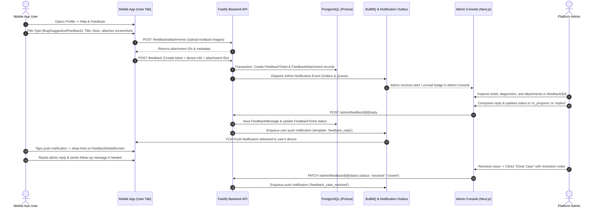

# Mobile Feedback, Bug Reporting, Suggestions, and Admin Support Console

## Overview

Deliver a complete customer feedback and bug reporting loop across Expyrico:
1. **Mobile App (User Tab / Profile)**: Users can submit Feedback, Bug Reports, and Suggestions with a title, detailed description, and image/file attachments (screenshots, camera photos, error logs). Users can view ticket status and engage in a two-way conversation thread with support.
2. **Backend API & Data Engine**: PostgreSQL/Prisma models (`FeedbackTicket`, `FeedbackAttachment`, `FeedbackMessage`), authenticated endpoints with strict rate limiting, secure private attachment storage with path-traversal prevention, and background notification triggers via BullMQ.
3. **Notification Engine**: Immediate notification to platform administrators upon new ticket submission (admin dashboard badge + moderation notification dispatch), and push notifications to the user's mobile device when an administrator replies or closes the case.
4. **Admin Console (`apps/admin`)**: A dedicated "User Feedback" management module featuring queue filtering (status, type, age, search), rich ticket inspection with user and device diagnostics, image attachment previewers, full two-way reply composition, and case resolution/closing controls.

## Goals

| # | Goal | Priority |
|---|------|----------|
| 1 | Provide a frictionless, native mobile touchpoint in the User Profile tab for bug reporting, feature suggestions, and feedback with image/file attachments | P1 |
| 2 | Secure private media attachment storage, validation, and streaming with path-traversal protection and strict MIME allowlisting | P1 |
| 3 | Deliver automated notification flows: alerting admins on new submissions and notifying users via push notifications upon admin replies/closures | P1 |
| 4 | Equip administrators with a high-efficiency dashboard to filter, inspect diagnostics, reply to users, and close resolved tickets | P1 |
| 5 | Maintain strict Expyrico design tokens, color palette compliance, and security invariants (Zod validation, rate limiting, and permission isolation) | P1 |

## Phases

| # | Phase | Status |
|---|-------|--------|
| 1 | [Phase 1: Contracts, Data Models, and Attachment Storage Foundation](./phase-01-start.md) | Completed |
| 2 | [Phase 2: Backend API Services, Endpoints, and Notification Triggers](./phase-02-backend-api-and-notifications.md) | Completed |
| 3 | [Phase 3: Admin Console Management, Conversation Thread, and Case Resolution UI](./phase-03-admin-console-management-and-replies.md) | Completed |
| 4 | [Phase 4: Mobile User Profile Touchpoint, Ticket Submission, and Attachment Handling](./phase-04-mobile-submission-and-attachments.md) | Completed |
| 5 | [Phase 5: Mobile Conversation Thread, Push Notification Deep-Linking, and End-to-End Verification](./phase-05-mobile-conversation-push-and-verification.md) | Completed |

## Architecture & Data Flow

## Success Criteria

- [x] Mobile app Profile screen contains an accessible, themed "Help & Feedback" entry point matching Expyrico design guidelines.
- [x] Users can submit Bug Reports, Feature Suggestions, or General Feedback with validated title, description, and up to 5 image/file attachments.
- [x] Mobile submission automatically captures device diagnostics (OS version, app version, device model) for bug reports without leaking sensitive user data.
- [x] Backend validates all payloads using Zod, enforces rate limiting, and securely stores private attachments without path traversal risks.
- [x] Admins are notified of new submissions via an unread counter badge in the admin navigation and notification events.
- [x] Admins can view tickets in `/feedback`, filter by status and type, inspect device diagnostics and attachments, send replies, and close cases.
- [x] Users receive FCM push notifications on admin reply or case resolution and tapping navigates directly to the ticket conversation.
- [x] Both user and admin interfaces follow Expyrico color requirements: Fresh Sage (`#4BAE8A`), Deep Sage (`#3A8F6F`), Mint Mist (`#D6F0E6`), Honey (`#F5A623`), Warm White (`#FAFAF8`), Stone (`#F0F0ED`), and Almost Black (`#2C2C28`).

## Validation Log

### Verification Results
- Claims checked: 18 across 5 phases
- Verified: 18 | Failed: 0 | Unverified: 0
- Tier: Full (5 phases, all components grounded)
- Failures: None

### Interview Decisions Confirmed
1. **Attachment Storage Strategy**:
   - **Decision**: Local Private Media Root (`config.media.root/private/feedback/...`) with authenticated streaming endpoint `/feedback/attachments/:id`.
   - **Rationale**: Zero external cloud storage dependencies, isolates sensitive user files, and matches the established product media storage pattern.
2. **Admin Alerting Mechanism**:
   - **Decision**: Dashboard Live Badge + Email Notification Alert.
   - **Rationale**: Real-time counter on the Admin Console navigation alert queue coupled with an email dispatch via the existing nodemailer moderation transport ensures on-call administrators are notified immediately.
3. **Case Closure & Reopen Policy**:
   - **Decision**: Lock on Resolution.
   - **Rationale**: Once an administrator marks a case resolved or closed, user replies are disabled with a clean explanatory banner prompting the user to submit a new ticket if issues recur, preserving audit trails and preventing zombie tickets.

### Whole-Plan Consistency Sweep
- **Status**: Passed with 0 contradictions
- **Cross-check**:
  - Storage: Private media root verified across Phase 1, Phase 2, and Phase 3.
  - Notifications: Email alert + Admin badge verified across Phase 2 and Phase 3; FCM user push notifications verified across Phase 2, Phase 4, and Phase 5.
  - Closure: Reply locking verified across Phase 2, Phase 3, and Phase 5.
  - Routes and types: 100% consistent across all phase files and shared schemas.

<!-- slug: mobile-feedback-bug-report-and-admin-support -->
