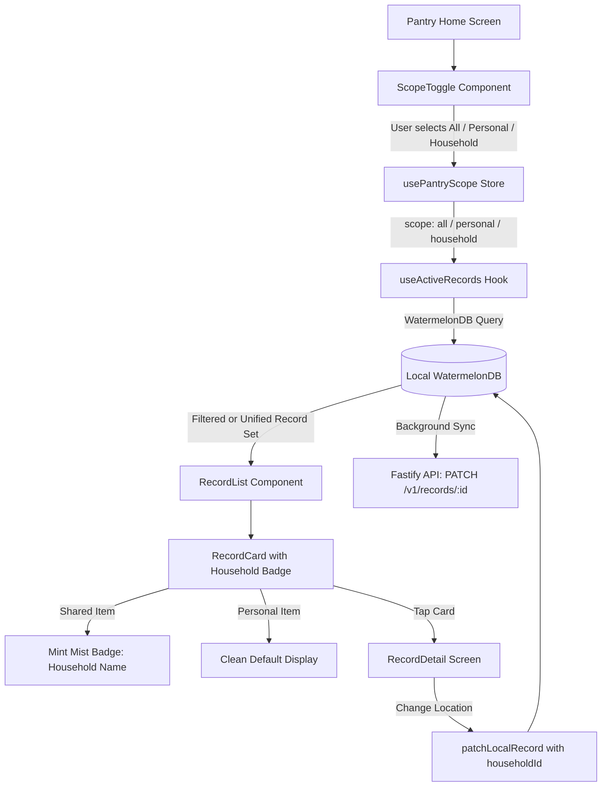

# Mobile Unified Pantry and Household Sharing Architecture

## Overview

Deliver a unified, anti-food-waste pantry experience on the mobile app:
1. **Unified Default ("All Items")**: By default, users living with roommates, family, or partners see all pantry items expiring across their home in a single unified list, preserving Expyrico's core "Use what you need first" mechanic.
2. **Top-Level Scope Switcher (`ScopeToggle`)**: An accessible, themed segmented pill control (`All` · `Personal` · `[Household Name]`) allowing instant 1-tap filtering between whole-house inventory, personal groceries, and specific households.
3. **Card Attribution Badges (`RecordCard`)**: Items belonging to a household display an Expyrico-themed attribution badge (`Family Pantry`, Mint Mist `#D6F0E6` background, Deep Sage `#3A8F6F` text, and `people-outline` icon), so ownership is visually clear at a glance in the unified view.
4. **Scope Reassignment & Move Flow (`RecordDetail` & Creation)**: Users can move an item between Personal and Household pantries via a clean location picker in `RecordDetail`, and new items default to the active scope.
5. **Local Query & Offline Sync Integration**: Expands `PantryScope` to include `'all'`, removes `household_id` restrictions in `useActiveRecords` for `'all'`, and updates `patchLocalRecord` to support `householdId` mutations across WatermelonDB and server sync.

## Goals

| # | Goal | Priority |
|---|------|----------|
| 1 | Unify personal and shared household pantry items into a single default urgency list to prevent food waste | P1 |
| 2 | Provide a 1-tap top-level scope toggle (`All` · `Personal` · `[Household Name]`) for quick filtering | P1 |
| 3 | Clearly distinguish shared vs personal items with accessible attribution badges on item cards in unified mode | P1 |
| 4 | Allow users to assign or move items between personal and household scopes during creation and editing | P1 |
| 5 | Maintain offline-first WatermelonDB sync and Expyrico design token compliance across all themes | P1 |

## Phases

| # | Phase | Status |
|---|-------|--------|
| 1 | [Phase 1: Scope State and WatermelonDB Query Expansion](./phase-01-start.md) | Completed |
| 2 | [Phase 2: ScopeToggle Segmented Control Update](./phase-02-scope-toggle-segmented-control.md) | Completed |
| 3 | [Phase 3: Item Card Visual Attribution Badges](./phase-03-item-card-attribution-badges.md) | Completed |
| 4 | [Phase 4: Move & Assign Scope in Item Detail and Creation](./phase-04-move-and-assign-scope-ux.md) | Completed |
| 5 | [Phase 5: FilterModal Integration, Search, and End-to-End Verification](./phase-05-filter-integration-and-verification.md) | Completed |

## Architecture & Data Flow

## Success Criteria

- [x] Users belonging to $\ge 1$ household see a segmented switcher at the top of the pantry: `All` · `Personal` · `[Household Name]`.
- [x] `All` view displays both personal and shared household groceries sorted by urgency (expiring soonest first).
- [x] Shared groceries clearly render a themed attribution badge (`[Household Name]` or `Family Pantry`) on the card.
- [x] Tapping `Personal` filters strictly to items where `householdId === null`.
- [x] Tapping a household name filters strictly to items belonging to that household.
- [x] Users without any household see a clean single pantry without an unnecessary toggle.
- [x] Users can reassign an item between Personal and Household in `RecordDetail`.
- [x] Scanning or creating an item always defaults to Personal Pantry (`householdId: null`), with an option to assign/move to a household.
- [x] All components conform to Expyrico palette (Fresh Sage `#4BAE8A`, Mint Mist `#D6F0E6`, Warm White `#FAFAF8`, Stone `#F0F0ED`, Almost Black `#2C2C28`).
- [x] Full automated test suite passes with unit and snapshot coverage.

## Validation Log

### Verification Results
- Claims checked: 14 across 5 phases
- Verified: 14 | Failed: 0 | Unverified: 0
- Tier: Full (5 phases, all components grounded)
- Failures: None

### Interview Decisions Confirmed
1. **Zero-Household Toggle Behavior**:
   - **Decision**: Auto-hide when no households.
   - **Rationale**: Solo pantry users with 0 households see a distraction-free, full-width pantry header without an unnecessary toggle; the `ScopeToggle` appears dynamically defaulting to `All` once the user joins or creates a household.
2. **Add/Scan Default Location**:
   - **Decision**: Always default to Personal Pantry (`householdId: null`).
   - **Rationale**: User explicitly decided that newly scanned or added groceries always belong to the personal pantry first, preventing accidental household clutter unless intentionally moved or assigned.
3. **Card Attribution Badge Visibility**:
   - **Decision**: Show attribution badge only in `All` mode.
   - **Rationale**: When filtering by a single household or by Personal, all items already belong to that scope; displaying repetitive badges on every card is redundant visual noise. The badge is displayed exclusively in unified `All` mode where visual disambiguation is critical.

### Whole-Plan Consistency Sweep
- **Status**: Passed with 0 contradictions
- **Cross-check**:
  - Default location: Phase 4 updated to guarantee `householdId: null` default on new items.
  - Badge visibility: Phase 3 updated to check `scope === 'all'` before rendering card badge.
  - Toggle auto-hide: Phase 2 updated with `if (households.length === 0) return null`.
  - Database and sync: Phase 1 WatermelonDB query mechanics and `patchLocalRecord` validated.

<!-- slug: mobile-unified-pantry-household-sharing -->
