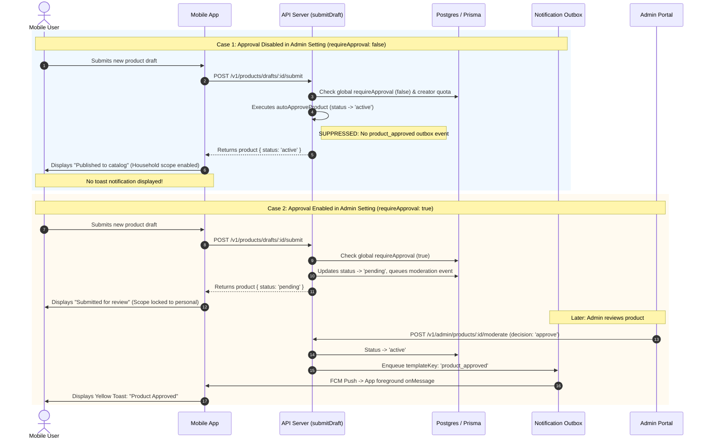

# Conditional Product Approval Notification Based on Admin Moderation Setting

## Executive Summary
In Expyrico, administrators can configure the **Community Product Approval Policy** via Admin Settings (`SETTING_KEYS.PRODUCT_CREATION`, `requireApproval: boolean`):
1. **Auto-Approve (Approval Disabled - Default, `requireApproval: false`)**: New community products submitted by users bypass administrative moderation and are immediately activated into the catalog (`status: 'active'`).
2. **Require Approval (Approval Enabled, `requireApproval: true`)**: New community products are diverted to the moderation queue with `status: 'pending'`, awaiting manual review and decision by an administrator.

Currently, when a product is auto-approved by platform policy (`autoApproveProduct` in `api/src/services/products/auto-approval.ts`), the backend erroneously enqueues a `templateKey: 'product_approved'` notification into the creator's notification outbox. When swept, Firebase Cloud Messaging (FCM) delivers this to the user's mobile device, triggering an in-app banner toast:
> **Product Approved**  
> Your product Protect 24h Sanitizing Wipes has been approved!

This creates severe user confusion: the user just submitted the product, there was no approval process, and the screen behind the toast simultaneously claims "Submitted for review — you can add it to your pantry now."

This plan aligns the notification behavior directly with the admin setting:
- **When approval requirement is disabled (`requireApproval: false`)**: The backend suppresses outbox enqueuing for auto-approval. No FCM push is dispatched, and no "Product Approved" toast is shown. The mobile post-submission view confirms "Published to catalog — you can add it to your pantry now" with unlocked household scope.
- **When approval requirement is enabled (`requireApproval: true`)**: The product remains `status: 'pending'`. The mobile screen shows "Submitted for review" with locked personal scope. The user receives the "Product Approved" toast **only** when an administrator manually approves the product in the admin moderation console.

---

## Goals & Boundaries

| # | Goal | Priority | Description |
|---|------|----------|-------------|
| 1 | Backend Notification Suppression | P1 | Eliminate `enqueueOutbox(..., templateKey: 'product_approved')` from `autoApproveProduct` in `api/src/services/products/auto-approval.ts`. |
| 2 | Manual Approval Notification Retention | P1 | Preserve `enqueueOutbox(..., templateKey: 'product_approved')` in `api/src/services/products/product-moderation.ts` so manual admin approval triggers notifications as expected. |
| 3 | Mobile Post-Submission Confirmation | P1 | Update `apps/mobile/app/(app)/product/new.tsx` to distinguish `status: 'active'` ("Published to catalog") from `status: 'pending'` ("Submitted for review"), and unlock household scope for active items. |
| 4 | End-to-End Verification | P1 | Automated tests across API integration suite and mobile route tests, followed by physical Android device verification. |

### Non-Goals
- Changing the schema or structure of `productCreationSettingsSchema` (already has `requireApproval: z.boolean().default(false)`).
- Altering the admin UI radio buttons in `apps/admin/src/app/(admin)/settings/feature-flags/flags-form.tsx` (already supports toggling `requireApproval`).
- Modifying moderation status for product edits (`product-edits.ts`) which already has separate versioning and supersede pathways.

---

## Architecture & Data Flow

---

## Phases Overview

| Phase | Title | Effort | Status | Dependencies |
|-------|-------|--------|--------|--------------|
| 1 | [Backend Notification Suppression on Auto-Approval](./phase-01-start.md) | 2h | Pending | None |
| 2 | [Mobile Client Confirmation & Scope Optimization](./phase-02-mobile-client-confirmation.md) | 2h | Pending | Phase 1 |
| 3 | [Automated Testing & Device Verification](./phase-03-testing-and-verification.md) | 3h | Pending | Phase 1, Phase 2 |

---

## Success Criteria
- [ ] Submitting a product when `requireApproval: false` produces 0 outbox notifications and emits 0 FCM messages.
- [ ] No "Product Approved" toast banner appears on the mobile device during or after submitting a product when approval is disabled.
- [ ] Submitting a product when `requireApproval: false` shows "Published to catalog — you can add it to your pantry now." on the post-submission screen.
- [ ] Submitting a product when `requireApproval: true` holds the product in `pending` and displays "Submitted for review — you can add it to your pantry now."
- [ ] When an admin manually approves a pending product in the admin portal, the creator receives the FCM push and the "Product Approved" toast appears.
- [ ] All integration tests in `@expyrico/api` and component tests in `apps/mobile` pass.
