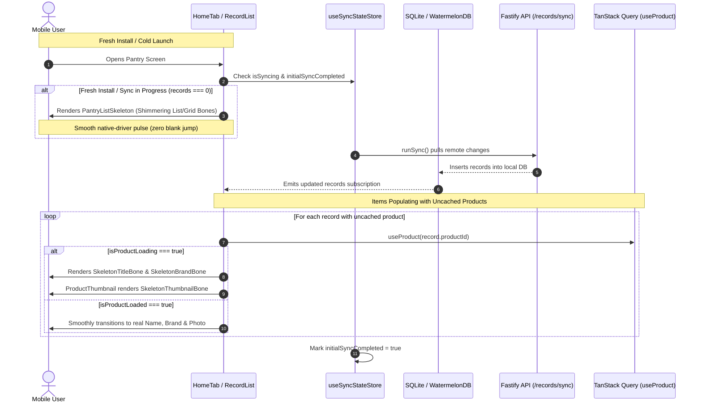

# Mobile Shimmer Skeleton Loading System & Fresh-Install UX Architecture

## Executive Summary
Currently, when a user freshly installs the app, logs into a new device, or launches the app with cold caches:
1. **Premature Empty State Jump**: Because the local SQLite/WatermelonDB `records` table is empty (`records.length === 0`), `RecordList` immediately flashes the `"Start your pantry / Scan the first item"` empty card. When the background initial sync (`runSync()`) completes 1–2 seconds later, the empty state abruptly disappears and items pop in, creating an unsettling visual flicker.
2. **Missing Name Flash ("Item")**: When items sync, `record.customName` is typically null for catalog products, relying on `product?.name` from `useProduct(record.productId)`. With cold TanStack query caches, the component defaults to rendering the literal string `"Item"` and empty brand text until the HTTP query resolves.
3. **Missing Image / Blank Box Flash**: In `ProductThumbnail` and `PantryGridCard`, while remote images are downloading or hydrating from disk, the image component renders a transparent/white box or a generic fallback icon (`nutrition-outline`), popping in abruptly when the image finishes loading.

This plan delivers a unified, native-driver **Shimmer Skeleton Loading System** across `@expyrico/mobile`, eliminating blank flashes, premature empty states, and unstyled placeholder text across all item lists, grid tiles, thumbnails, and detail views.

---

## Architecture & Data Flow

---

## Phases Overview

| Phase | Name | Scope | Key Deliverables | Status |
|---|---|---|---|---|
| 1 | [Skeleton Core & Shimmer Primitives](./phase-01-skeleton-primitives.md) | `apps/mobile` | `SkeletonShimmer`, `SkeletonBone`, `RecordCardSkeleton`, `PantryGridCardSkeleton`, theme-token color resolver, reduced-motion accessibility | Pending |
| 2 | [Thumbnail & Card Inline Loading](./phase-02-thumbnail-and-card-loading.md) | `apps/mobile` | `ProductThumbnail` skeleton state, `RecordCard` & `PantryGridCard` title/brand shimmer fallbacks (replacing `"Item"`), image cross-fade | Pending |
| 3 | [Initial Sync & Pantry View Skeletons](./phase-03-initial-sync-and-pantry-skeleton.md) | `apps/mobile` | `useSyncStateStore`, `runSync` lifecycle hooks, `RecordList` fresh-install skeleton gating (preventing premature empty card) | Pending |
| 4 | [Detail Screens & E2E Verification](./phase-04-detail-screens-and-e2e-verification.md) | `apps/mobile` | `RecordDetailSkeleton`, `ProductDetailSkeleton`, Jest unit tests, Android debug build and device smoke test | Pending |

---

## Critical Invariants & Design Token Mandates

1. **Native Driver Exclusivity**:
   * All shimmer pulse animations MUST run exclusively via React Native's `Animated` with `useNativeDriver: true`. Zero JS-thread animation loops or bridge round-trips.
2. **Strict Expyrico Palette Adherence (useTheme Tokens Only)**:
   * Bone backgrounds and highlights MUST resolve strictly via `useTheme().colors`:
     * **Light Theme**: Base bone `theme.colors.neutralLight` (`#F0F0ED` Stone), pulse highlight `theme.colors.bgGlass` (`#D6F0E6` Mint Mist) or `theme.colors.bgElevated` (`#FAFAF8` Warm White).
     * **Dark Theme**: Base bone `theme.colors.neutralLight` (`#2D3A34`), pulse highlight `theme.colors.bgGlass` (`#1F342C`).
   * Zero ad-hoc dark hexes (`#262624`/`#363632` strictly prohibited).
3. **Accessibility, Reduced Motion & Timer Cleanup**:
   * Skeleton loaders MUST inspect `AccessibilityInfo.isReduceMotionEnabled()`. When reduced motion is enabled, animations stop and render a static bone.
   * Every `Animated.loop` MUST be stopped on component unmount (`anim.stop()`) to prevent timer leaks during fast virtualized scrolling.
4. **No Premature Empty State Flashes**:
   * `RecordList` MUST NEVER render the empty pantry card (`Start your pantry`) if an initial sync is active and records are empty. It MUST display `PantryListSkeleton` until sync settles.
5. **No Raw "Item" Text Flash**:
   * Components MUST NEVER display the hardcoded string `"Item"` or empty spaces while `useProduct` is fetching uncached catalog data. They MUST render inline shimmering bones matching the text line height.
6. **Readiness Contract Equation & Screen Inventory**:
   * Skeleton dismissal MUST satisfy:
     `isReady = dataReady && allVisibleImagesSettled`
   * Skeletons MUST NOT be dismissed on metadata/query `isLoading` alone while image placeholders remain. Both metadata AND visible images (warm cache hit, `onLoadEnd`, or `onError` fallback) must reach terminal settlement before unmasking.
   * Full screen inventory:
     1. **Pantry List View**: `RecordCard.tsx` inside `RecordList.tsx`
     2. **Pantry Grid View**: `PantryGridCard.tsx` inside `RecordList.tsx`
     3. **Record Detail Screen**: `record/[id].tsx` with `RecordDetailSkeleton`
     4. **Product Detail Screen**: `product/[id].tsx` with `ProductDetailSkeleton`
     5. **Pantry History View**: `PantryHistoryView.tsx` with KPI & row bones
7. **`useRecordWithStatus` State Discrimination**:
   * `apps/mobile/src/api/records.ts` MUST export `useRecordWithStatus(id)` providing `{ record, isLoading, isResolved }`. Components must not gate on `!record` alone, cleanly distinguishing in-flight SQLite lookups from terminal "Item not found" states.
8. **Source-Transition Settlement Reset in `ProductThumbnail`**:
   * `ProductThumbnail` MUST key image settlement on `renderUri = uri || candidate`. When `useCachedImage` hydrates and switches source from remote candidate to cached URI, settlement state MUST reset to `false` until the new source settles.
9. **Session-Scoped Reset Only (Never on Local Scope Switch)**:
   * `useSyncStateStore` MUST provide a `reset()` action wired strictly into `clearAllLocalUserData()` and `signIn()` in `session-store.ts`. It MUST NOT be invoked on local scope switches (`usePantryScope.setScope`), because all household records are already synced locally into SQLite; resetting on local scope changes would leave an empty household trapped waiting for the 4-second timeout.
10. **`usePantryHistoryRecordsWithStatus` State Discrimination**:
   * `apps/mobile/src/api/records.ts` MUST export `usePantryHistoryRecordsWithStatus(filter)` providing `{ records, isLoading, isResolved }`. In `PantryHistoryView.tsx`, skeleton bones MUST only render while `(!isResolved || (!initialSyncCompleted && isSyncing))` — NEVER on `records.length === 0` alone. Once resolved, genuine empty history displays `renderEmpty()` immediately with zero skeleton delay.
## Validation Log

### Session — 2026-09-14
**Verification Results:**
- Claims checked: 10
- Verified: 10 | Failed: 0 | Unverified: 0
- Tier: Standard (Fact Checker + Contract Verifier)

**Interview Decisions Confirmed:**
1. **Shimmer Animation Style**: `Subtle Native Opacity Pulse` (0.4 to 1.0 at 850ms, strictly via `useTheme().colors` tokens: `theme.colors.neutralLight` base `#F0F0ED` light / `#2D3A34` dark, `useNativeDriver: true`).
2. **Fresh-Install Sync Timeout**: `4-Second Fail-Safe Timeout` with NetInfo offline check. Gracefully transitions to genuine empty state + offline banner if connection fails.
3. **Skeleton Card Count**: `Viewport-Filling Preset` (5 items in List view, 6 items in 2-column Grid view).
4. **Detail View Skeleton Scope**: `Full Structural Skeleton` (220px hero image bone, title bone, sentiment strip bone, date pills, action button bones).

**Advisory Blockers Resolved:**
1. **Detail Screen Image Settlement Blocker**: Added dedicated image settlement tracking (`onLoadEnd`/`onError`) for hero and gallery images, preventing hero blank gaps after metadata resolution.
2. **ProductThumbnail Source-Swap Blocker**: Keyed settlement on `renderUri = uri || candidate`, resetting settlement state on source changes so initial candidate loads do not unmask prior to cached URI settlement.
3. **Detail Screen Linked Product Metadata Blocker**: Extended detail skeleton gate to include `record.productId && !record.customName && isProductLoading`, eliminating the `"Pantry Item"` title flash on deep links.

---

## Red Team Review (Pre-Planning Adversarial Audit)

| # | Attack Vector / Failure Mode | Severity | Mitigation in Plan |
|---|---|---|---|
| 1 | **CPU/Battery Drain from Multiple Infinite Loops**: 10+ visible cards looping separate `Animated.loop` timers simultaneously. | High | Centralize pulse phase inside `SkeletonShimmer` using a single coordinated `Animated.Value`, and bound skeleton rendering to viewport preset (5-6 items). |
| 2 | **Infinite Skeleton on Network/Sync Failure**: If device is offline on fresh install or API errors out, user could be trapped forever in a skeleton screen. | High | Implement a 4-second timeout on initial sync state; if sync fails or times out, gracefully transition to the genuine empty state with an offline banner. |
| 3 | **Layout Shift (CLS) between Skeleton & Real Card**: Skeleton bone height/padding differs from final rendered text/image, causing jarring layout shifts. | Medium | Build `RecordCardSkeleton` and `PantryGridCardSkeleton` with pixel-perfect dimensional parity (heights, paddings, borders, aspect ratios) to real cards. |
| 4 | **Detail Screen Metadata vs. Image Settlement Race**: Metadata resolves first, unmasking detail view while 220px hero photo is still downloading. | High | Integrate hero photo settlement tracking with absolute skeleton overlay until `onLoadEnd` fires. |
| 5 | **Thumbnail Source Transition Race**: `useCachedImage` replaces candidate URI with cached URI after initial render, causing premature skeleton unmounting. | High | Key settlement state to `renderUri`, resetting settlement on source changes and keeping skeleton bone active until new URI settles. |

### Whole-Plan Consistency Sweep
- Confirmed zero unresolved contradictions across `plan.md` and all 4 phase documents (`phase-01-skeleton-primitives.md`, `phase-02-thumbnail-and-card-loading.md`, `phase-03-initial-sync-and-pantry-skeleton.md`, `phase-04-detail-screens-and-e2e-verification.md`).
- Confirmed all 5 advisory concerns and blockers formally integrated with concrete technical contracts:
  1. **Strict Theme Tokens**: Zero ad-hoc dark hexes; skeleton base resolves to `theme.colors.neutralLight` (`#F0F0ED` light / `#2D3A34` dark) and highlight to `theme.colors.bgGlass`/`bgElevated`.
  2. **Readiness Contract Equation**: Formalized as `dataReady && allVisibleImagesSettled` across all 5 inventory screens with mock slow-image test coverage.
  3. **Thumbnail Source-Transition Settlement Reset**: Keyed settlement on `renderUri = uri || candidate`, resetting settlement state on source changes so initial candidate loads do not unmask prior to cached URI settlement.
  4. **useRecordWithStatus State Discrimination**: Distinct `isLoading`, `isResolved`, and `record` states in `apps/mobile/src/api/records.ts`, preventing false "Item not found" flashes or infinite skeletons.
  5. **Session-Scoped Reset Only**: `useSyncStateStore.getState().reset()` is strictly session-scoped (`clearAllLocalUserData` and `signIn`), preserving instant SQLite-backed filtering on local household scope switches without triggering spurious timeouts.
  6. **Pantry History State Discrimination**: Exported `usePantryHistoryRecordsWithStatus` so empty-history users see `renderEmpty()` immediately upon DB resolution, avoiding permanent/timeout skeletons.
  7. **Component Parity**: Dedicated, unambiguous `RecordDetailSkeleton.tsx` and `ProductDetailSkeleton.tsx` exports.
  8. **Test Command Alignment**: Explicit command targeting all 4 new unit test files.
