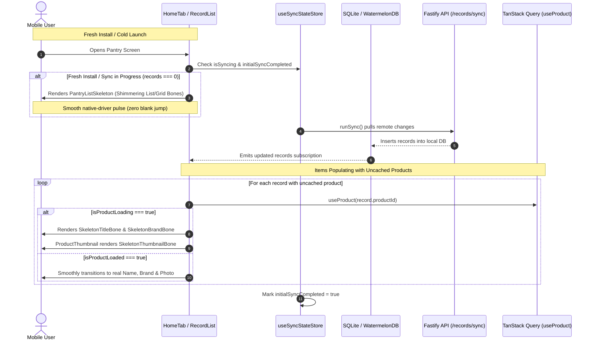

# Mobile Shimmer Skeleton Loading System & Fresh-Install UX Architecture

## Executive Summary
Currently, when a user freshly installs the app, logs into a new device, or launches the app with cold caches:
1. **Premature Empty State Jump**: Because the local SQLite/WatermelonDB `records` table is empty (`records.length === 0`), `RecordList` immediately flashes the `"Start your pantry / Scan the first item"` empty card. When the background initial sync (`runSync()`) completes 1–2 seconds later, the empty state abruptly disappears and items pop in, creating an unsettling visual flicker.
2. **Missing Name Flash ("Item")**: When items sync, `record.customName` is typically null for catalog products, relying on `product?.name` from `useProduct(record.productId)`. With cold TanStack query caches, the component defaults to rendering the literal string `"Item"` and empty brand text until the HTTP query resolves.
3. **Missing Image / Blank Box Flash**: In `ProductThumbnail` and `PantryGridCard`, while remote images are downloading or hydrating from disk, the image component renders a transparent/white box or a generic fallback icon (`nutrition-outline`), popping in abruptly when the image finishes loading.

This plan delivers a unified, native-driver **Shimmer Skeleton Loading System** across `@expyrico/mobile`, eliminating blank flashes, premature empty states, and unstyled placeholder text across all item lists, grid tiles, thumbnails, and detail views.

---

## Architecture & Data Flow

---

## Phases Overview

| Phase | Name | Scope | Key Deliverables | Status |
|---|---|---|---|---|
| 1 | [Skeleton Core & Shimmer Primitives](./phase-01-skeleton-primitives.md) | `apps/mobile` | `SkeletonShimmer`, `SkeletonBone`, `RecordCardSkeleton`, `PantryGridCardSkeleton`, theme-token color resolver, reduced-motion accessibility | Pending |
| 2 | [Thumbnail & Card Inline Loading](./phase-02-thumbnail-and-card-loading.md) | `apps/mobile` | `ProductThumbnail` skeleton state, `RecordCard` & `PantryGridCard` title/brand shimmer fallbacks (replacing `"Item"`), image cross-fade | Pending |
| 3 | [Initial Sync & Pantry View Skeletons](./phase-03-initial-sync-and-pantry-skeleton.md) | `apps/mobile` | `useSyncStateStore`, `runSync` lifecycle hooks, `RecordList` fresh-install skeleton gating (preventing premature empty card) | Pending |
| 4 | [Detail Screens & E2E Verification](./phase-04-detail-screens-and-e2e-verification.md) | `apps/mobile` | `RecordDetailSkeleton`, `ProductDetailSkeleton`, Jest unit tests, Android debug build and device smoke test | Pending |

---

## Critical Invariants & Design Token Mandates

1. **Native Driver Exclusivity**:
   * All shimmer pulse animations MUST run exclusively via React Native's `Animated` with `useNativeDriver: true`. Zero JS-thread animation loops or bridge round-trips.
2. **Strict Expyrico Palette Adherence**:
   * Bone backgrounds and highlights MUST resolve strictly to tokens in `docs/design/expyrico-colour-palette.md` and `packages/theme/src/palette.ts`:
     * **Light Theme**: Bone base `Stone #F0F0ED`, shimmer pulse highlight `#E6E6E3` (or `Warm White #FAFAF8`).
     * **Dark Theme**: Bone base `#262624`, shimmer pulse highlight `#363632`.
   * No ad-hoc neon hexes or muddy alpha overlays.
3. **Accessibility & Reduced Motion**:
   * Skeleton loaders MUST inspect `AccessibilityInfo.isReduceMotionEnabled()`. When reduced motion is enabled, animations stop and render a static bone to prevent vestibular discomfort.
4. **No Premature Empty State Flashes**:
   * `RecordList` MUST NEVER render the empty pantry card (`Start your pantry`) if an initial sync is active and records are empty. It MUST display `PantryListSkeleton` until sync settles.
5. **No Raw "Item" Text Flash**:
   * Components MUST NEVER display the hardcoded string `"Item"` or empty spaces while `useProduct` is fetching uncached catalog data. They MUST render inline shimmering bones matching the text line height.

---

## Validation Log

### Session — 2026-09-14
**Preflight Analysis:**
- Codebase audited: 0 existing skeleton components in `apps/mobile/src`.
- Problem confirmed: `RecordCard` and `PantryGridCard` fall back to literal `'Item'` when `record.customName` is null and `product` is loading.
- Fresh-install behavior confirmed: `runSync()` is unobserved by `RecordList`, causing an instant empty state followed by pop-in.

---

## Red Team Review (Pre-Planning Adversarial Audit)

| # | Attack Vector / Failure Mode | Severity | Mitigation in Plan |
|---|---|---|---|
| 1 | **CPU/Battery Drain from Multiple Infinite Loops**: 10+ visible cards looping separate `Animated.loop` timers simultaneously. | High | Centralize or synchronize pulse phase using a shared looped timing value, or bound skeleton rendering to viewport count (max 5-6 items). |
| 2 | **Infinite Skeleton on Network/Sync Failure**: If device is offline on fresh install or API errors out, user could be trapped forever in a skeleton screen. | High | Implement a 4-second timeout on initial sync state; if sync fails or times out, gracefully transition to the genuine empty state with an offline banner. |
| 3 | **Layout Shift (CLS) between Skeleton & Real Card**: Skeleton bone height/padding differs from final rendered text/image, causing jarring layout shifts. | Medium | Build `RecordCardSkeleton` and `PantryGridCardSkeleton` with pixel-perfect dimensional parity (heights, paddings, borders, aspect ratios) to real cards. |
