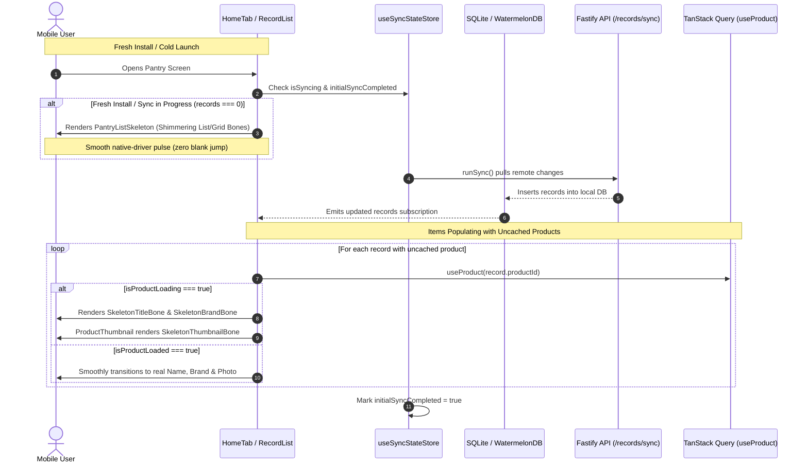

# Mobile Shimmer Skeleton Loading System & Fresh-Install UX Architecture

## Executive Summary
Currently, when a user freshly installs the app, logs into a new device, or launches the app with cold caches:
1. **Premature Empty State Jump**: Because the local SQLite/WatermelonDB `records` table is empty (`records.length === 0`), `RecordList` immediately flashes the `"Start your pantry / Scan the first item"` empty card. When the background initial sync (`runSync()`) completes 1–2 seconds later, the empty state abruptly disappears and items pop in, creating an unsettling visual flicker.
2. **Missing Name Flash ("Item")**: When items sync, `record.customName` is typically null for catalog products, relying on `product?.name` from `useProduct(record.productId)`. With cold TanStack query caches, the component defaults to rendering the literal string `"Item"` and empty brand text until the HTTP query resolves.
3. **Missing Image / Blank Box Flash**: In `ProductThumbnail` and `PantryGridCard`, while remote images are downloading or hydrating from disk, the image component renders a transparent/white box or a generic fallback icon (`nutrition-outline`), popping in abruptly when the image finishes loading.

This plan delivers a unified, native-driver **Shimmer Skeleton Loading System** across `@expyrico/mobile`, eliminating blank flashes, premature empty states, and unstyled placeholder text across all item lists, grid tiles, thumbnails, and detail views.

---

## Architecture & Data Flow

---

## Phases Overview

| Phase | Name | Scope | Key Deliverables | Status |
|---|---|---|---|---|
| 1 | [Skeleton Core & Shimmer Primitives](./phase-01-skeleton-primitives.md) | `apps/mobile` | `SkeletonShimmer`, `SkeletonBone`, `RecordCardSkeleton`, `PantryGridCardSkeleton`, theme-token color resolver, reduced-motion accessibility | Pending |
| 2 | [Thumbnail & Card Inline Loading](./phase-02-thumbnail-and-card-loading.md) | `apps/mobile` | `ProductThumbnail` skeleton state, `RecordCard` & `PantryGridCard` title/brand shimmer fallbacks (replacing `"Item"`), image cross-fade | Pending |
| 3 | [Initial Sync & Pantry View Skeletons](./phase-03-initial-sync-and-pantry-skeleton.md) | `apps/mobile` | `useSyncStateStore`, `runSync` lifecycle hooks, `RecordList` fresh-install skeleton gating (preventing premature empty card) | Pending |
| 4 | [Detail Screens & E2E Verification](./phase-04-detail-screens-and-e2e-verification.md) | `apps/mobile` | `RecordDetailSkeleton`, `ProductDetailSkeleton`, Jest unit tests, Android debug build and device smoke test | Pending |

---

## Critical Invariants & Design Token Mandates

1. **Native Driver Exclusivity**:
   * All shimmer pulse animations MUST run exclusively via React Native's `Animated` with `useNativeDriver: true`. Zero JS-thread animation loops or bridge round-trips.
2. **Strict Expyrico Palette Adherence**:
   * Bone backgrounds and highlights MUST resolve strictly to tokens in `docs/design/expyrico-colour-palette.md` and `packages/theme/src/palette.ts`:
     * **Light Theme**: Bone base `Stone #F0F0ED`, shimmer pulse highlight `#E6E6E3` (or `Warm White #FAFAF8`).
     * **Dark Theme**: Bone base `#262624`, shimmer pulse highlight `#363632`.
   * No ad-hoc neon hexes or muddy alpha overlays.
3. **Accessibility & Reduced Motion**:
   * Skeleton loaders MUST inspect `AccessibilityInfo.isReduceMotionEnabled()`. When reduced motion is enabled, animations stop and render a static bone to prevent vestibular discomfort.
4. **No Premature Empty State Flashes**:
   * `RecordList` MUST NEVER render the empty pantry card (`Start your pantry`) if an initial sync is active and records are empty. It MUST display `PantryListSkeleton` until sync settles.
5. **No Raw "Item" Text Flash**:
   * Components MUST NEVER display the hardcoded string `"Item"` or empty spaces while `useProduct` is fetching uncached catalog data. They MUST render inline shimmering bones matching the text line height.
6. **Detail View Metadata & Image Settlement Contract**:
   * `record/[id].tsx` MUST NOT unmask prematurely when `record` is loaded from local SQLite if `record.productId && !record.customName && isProductLoading`. Both the linked product metadata AND the hero/gallery images MUST have explicit settlement gates (`onLoadEnd`/`onError`) with skeleton overlays before the full UI is revealed.
7. **Source-Transition Settlement Reset**:
   * `ProductThumbnail` and image loaders MUST key settlement on `renderUri = uri || candidate`. When `useCachedImage` hydrates and switches source from a remote candidate to a local cached URI, the settlement flag MUST reset to `false` and keep the skeleton bone active until the new source emits `onLoadEnd` or `onError`.
---

## Validation Log

### Session — 2026-09-14
**Verification Results:**
- Claims checked: 10
- Verified: 10 | Failed: 0 | Unverified: 0
- Tier: Standard (Fact Checker + Contract Verifier)

**Interview Decisions Confirmed:**
1. **Shimmer Animation Style**: `Subtle Native Opacity Pulse` (0.4 to 1.0 at 850ms, Expyrico Stone `#F0F0ED` to `#E6E6E3` in light, `#262624` to `#363632` in dark, `useNativeDriver: true`).
2. **Fresh-Install Sync Timeout**: `4-Second Fail-Safe Timeout` with NetInfo offline check. Gracefully transitions to genuine empty state + offline banner if connection fails.
3. **Skeleton Card Count**: `Viewport-Filling Preset` (5 items in List view, 6 items in 2-column Grid view).
4. **Detail View Skeleton Scope**: `Full Structural Skeleton` (220px hero image bone, title bone, sentiment strip bone, date pills, action button bones).

**Advisory Blockers Resolved:**
1. **Detail Screen Image Settlement Blocker**: Added dedicated image settlement tracking (`onLoadEnd`/`onError`) for hero and gallery images, preventing hero blank gaps after metadata resolution.
2. **ProductThumbnail Source-Swap Blocker**: Keyed settlement on `renderUri = uri || candidate`, resetting settlement state on source changes so initial candidate loads do not unmask prior to cached URI settlement.
3. **Detail Screen Linked Product Metadata Blocker**: Extended detail skeleton gate to include `record.productId && !record.customName && isProductLoading`, eliminating the `"Pantry Item"` title flash on deep links.

---

## Red Team Review (Pre-Planning Adversarial Audit)

| # | Attack Vector / Failure Mode | Severity | Mitigation in Plan |
|---|---|---|---|
| 1 | **CPU/Battery Drain from Multiple Infinite Loops**: 10+ visible cards looping separate `Animated.loop` timers simultaneously. | High | Centralize pulse phase inside `SkeletonShimmer` using a single coordinated `Animated.Value`, and bound skeleton rendering to viewport preset (5-6 items). |
| 2 | **Infinite Skeleton on Network/Sync Failure**: If device is offline on fresh install or API errors out, user could be trapped forever in a skeleton screen. | High | Implement a 4-second timeout on initial sync state; if sync fails or times out, gracefully transition to the genuine empty state with an offline banner. |
| 3 | **Layout Shift (CLS) between Skeleton & Real Card**: Skeleton bone height/padding differs from final rendered text/image, causing jarring layout shifts. | Medium | Build `RecordCardSkeleton` and `PantryGridCardSkeleton` with pixel-perfect dimensional parity (heights, paddings, borders, aspect ratios) to real cards. |
| 4 | **Detail Screen Metadata vs. Image Settlement Race**: Metadata resolves first, unmasking detail view while 220px hero photo is still downloading. | High | Integrate hero photo settlement tracking with absolute skeleton overlay until `onLoadEnd` fires. |
| 5 | **Thumbnail Source Transition Race**: `useCachedImage` replaces candidate URI with cached URI after initial render, causing premature skeleton unmounting. | High | Key settlement state to `renderUri`, resetting settlement on source changes and keeping skeleton bone active until new URI settles. |

### Whole-Plan Consistency Sweep
- Confirmed zero unresolved contradictions across `plan.md` and all 4 phase documents (`phase-01-skeleton-primitives.md`, `phase-02-thumbnail-and-card-loading.md`, `phase-03-initial-sync-and-pantry-skeleton.md`, `phase-04-detail-screens-and-e2e-verification.md`).
- Confirmed all 3 advisory blockers formally integrated with concrete technical contracts:
  1. Hero & gallery image settlement contract added to Phase 4 (`record/[id].tsx` and `product/[id].tsx`).
  2. Thumbnail source-transition settlement reset contract added to Phase 2 (`ProductThumbnail.tsx`).
  3. Linked product metadata gate added to Phase 4 (`isProductPending` with graceful `isProductError` fallback).
- Confirmed all 4 user interview decisions propagated across phases:
  1. Subtle native opacity pulse (0.4 to 1.0 at 850ms, Expyrico Stone tokens) in Phase 1.
  2. 4-second fail-safe timeout with offline check in Phase 3.
  3. Viewport-filling preset (5 List / 6 Grid) in Phase 3.
  4. Full structural skeleton in Phase 4.
