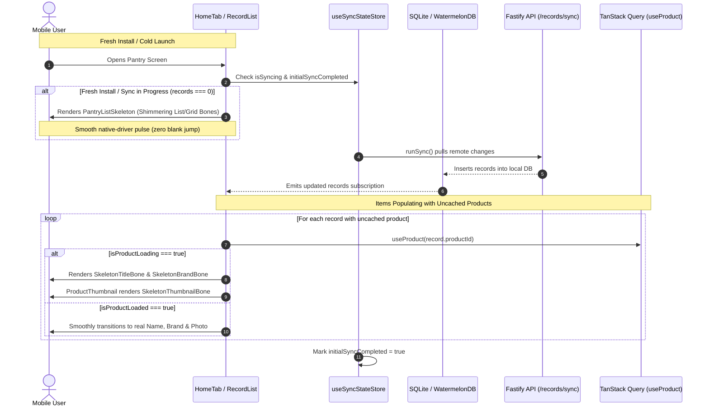

# Mobile Shimmer Skeleton Loading System & Fresh-Install UX Architecture

## Executive Summary
Currently, when a user freshly installs the app, logs into a new device, or launches the app with cold caches:
1. **Premature Empty State Jump**: Because the local SQLite/WatermelonDB `records` table is empty (`records.length === 0`), `RecordList` immediately flashes the `"Start your pantry / Scan the first item"` empty card. When the background initial sync (`runSync()`) completes 1–2 seconds later, the empty state abruptly disappears and items pop in, creating an unsettling visual flicker.
2. **Missing Name Flash ("Item")**: When items sync, `record.customName` is typically null for catalog products, relying on `product?.name` from `useProduct(record.productId)`. With cold TanStack query caches, the component defaults to rendering the literal string `"Item"` and empty brand text until the HTTP query resolves.
3. **Missing Image / Blank Box Flash**: In `ProductThumbnail` and `PantryGridCard`, while remote images are downloading or hydrating from disk, the image component renders a transparent/white box or a generic fallback icon (`nutrition-outline`), popping in abruptly when the image finishes loading.

This plan delivers a unified, native-driver **Shimmer Skeleton Loading System** across `@expyrico/mobile`, eliminating blank flashes, premature empty states, and unstyled placeholder text across all item lists, grid tiles, thumbnails, and detail views.

---

## Architecture & Data Flow

---

## Phases Overview

| Phase | Name | Scope | Key Deliverables | Status |
|---|---|---|---|---|
| 1 | [Skeleton Core & Shimmer Primitives](./phase-01-skeleton-primitives.md) | `apps/mobile` | `SkeletonShimmer`, `SkeletonBone`, `RecordCardSkeleton`, `PantryGridCardSkeleton`, theme-token color resolver, reduced-motion accessibility | Pending |
| 2 | [Thumbnail & Card Inline Loading](./phase-02-thumbnail-and-card-loading.md) | `apps/mobile` | `ProductThumbnail` skeleton state, `RecordCard` & `PantryGridCard` title/brand shimmer fallbacks (replacing `"Item"`), image cross-fade | Pending |
| 3 | [Initial Sync & Pantry View Skeletons](./phase-03-initial-sync-and-pantry-skeleton.md) | `apps/mobile` | `useSyncStateStore`, `runSync` lifecycle hooks, `RecordList` fresh-install skeleton gating (preventing premature empty card) | Pending |
| 4 | [Detail Screens & E2E Verification](./phase-04-detail-screens-and-e2e-verification.md) | `apps/mobile` | `RecordDetailSkeleton`, `ProductDetailSkeleton`, Jest unit tests, Android debug build and device smoke test | Pending |

---

## Critical Invariants & Design Token Mandates

1. **Native Driver Exclusivity**:
   * All shimmer pulse animations MUST run exclusively via React Native's `Animated` with `useNativeDriver: true`. Zero JS-thread animation loops or bridge round-trips.
2. **Strict Expyrico Palette Adherence (useTheme Tokens Only)**:
   * Bone backgrounds and highlights MUST resolve strictly via `useTheme().colors`:
     * **Light Theme**: Base bone `theme.colors.neutralLight` (`#F0F0ED` Stone), pulse highlight `theme.colors.bgGlass` (`#D6F0E6` Mint Mist) or `theme.colors.bgElevated` (`#FAFAF8` Warm White).
     * **Dark Theme**: Base bone `theme.colors.neutralLight` (`#2D3A34`), pulse highlight `theme.colors.bgGlass` (`#1F342C`).
   * Zero ad-hoc dark hexes (`#262624`/`#363632` strictly prohibited).
3. **Accessibility, Reduced Motion & Timer Cleanup**:
   * Skeleton loaders MUST inspect `AccessibilityInfo.isReduceMotionEnabled()`. When reduced motion is enabled, animations stop and render a static bone.
   * Every `Animated.loop` MUST be stopped on component unmount (`anim.stop()`) to prevent timer leaks during fast virtualized scrolling.
4. **No Premature Empty State Flashes**:
   * `RecordList` MUST NEVER render the empty pantry card (`Start your pantry`) if an initial sync is active and records are empty. It MUST display `PantryListSkeleton` until sync settles.
5. **No Raw "Item" Text Flash**:
   * Components MUST NEVER display the hardcoded string `"Item"` or empty spaces while `useProduct` is fetching uncached catalog data. They MUST render inline shimmering bones matching the text line height.
6. **Readiness Contract Equation & Screen Inventory**:
   * Detail view skeleton dismissal satisfies:
     `isDetailReady = dataReady && allVisibleImagesSettled`
   * Once metadata resolves (`dataReady`), the screen mounts its real layout immediately with `<ItemImageGallery />` mounted underneath an absolute skeleton bone overlay (`opacity: 0` underneath). Native `<Image>` begins network download and decoding on millisecond 0, cross-fading in on `onLoadEnd` with zero mounting deadlocks.
   * Full screen inventory:
     1. **Pantry List View**: `RecordCard.tsx` inside `RecordList.tsx`
     2. **Pantry Grid View**: `PantryGridCard.tsx` inside `RecordList.tsx`
     3. **Record Detail Screen**: `record/[id].tsx` with `RecordDetailSkeleton`
     4. **Product Detail Screen**: `product/[id].tsx` with `ProductDetailSkeleton`
     5. **Pantry History View**: `PantryHistoryView.tsx` with `PantryHistorySkeleton`
7. **`useRecordWithStatus` State Discrimination**:
   * `apps/mobile/src/api/records.ts` MUST export `useRecordWithStatus(id)` providing `{ record, isLoading, isResolved }`. In `record/[id].tsx`, terminal not-found is checked BEFORE metadata/image readiness:
     1. `isRecordLoading && !isRecordResolved -> <RecordDetailSkeleton />`
     2. `isRecordResolved && !record -> <ItemNotFoundView />`
     3. `isProductPending -> <RecordDetailSkeleton />`
8. **Source-Transition Settlement Reset in `ProductThumbnail`**:
   * `ProductThumbnail` MUST key image settlement on `renderUri = uri || candidate`. When `useCachedImage` hydrates and switches source from remote candidate to cached URI, settlement state MUST reset to `false` until the new source settles.
9. **Session-Scoped Reset & Multi-Account Isolation**:
   * `useSyncStateStore` MUST provide a `reset()` action wired strictly into `clearAllLocalUserData()` and `signIn()` in `session-store.ts`. It MUST NOT be invoked on local scope switches (`usePantryScope.setScope`).
   * Session generation tracking (`sessionGeneration`) invalidates stale in-flight sync callbacks from previous accounts.
   * `record-photo-storage.ts` provides `clearAllRecordPhotoAttachments()` invoked on logout, preventing device-only photo leakage across accounts.
10. **`usePantryHistoryRecordsWithStatus` State Discrimination**:
   * `apps/mobile/src/api/records.ts` MUST export `usePantryHistoryRecordsWithStatus(filter)` providing `{ records, isLoading, isResolved }`. In `PantryHistoryView.tsx`, skeleton bones MUST only render while `(!isHistoryResolved || (!initialSyncCompleted && displayRecords.length === 0))` — NEVER on `records.length === 0` alone after initial sync has settled.
11. **Dimensional Parity with Actual Geometry**:
   * Skeletons MUST replicate current production dimensions: `PantryGridCardSkeleton` uses 16px corners, 72×72px thumbnail bone, top action row, and 36px title block. Hero detail skeletons compute height dynamically via `Math.round(containerWidth * 0.75)`.
## Validation Log

### Session — 2026-09-14
**Verification Results:**
- Claims checked: 10
- Verified: 10 | Failed: 0 | Unverified: 0
- Tier: Standard (Fact Checker + Contract Verifier)

1. **Shimmer Animation Style**: `Subtle Native Opacity Pulse` (0.4 to 1.0 at 850ms, strictly via `useTheme().colors` tokens: `theme.colors.neutralLight` base `#F0F0ED` light / `#2D3A34` dark, `useNativeDriver: true`).
2. **Fresh-Install Sync Timeout**: `4-Second Deterministic Universal Fail-Safe Timeout`. Initiated upon session readiness; at 4,000ms, store forces `initialSyncCompleted = true` and `lastSyncError = 'timeout'`, gracefully unmasking all views to the empty state + offline/syncing status banner without user lockup.
3. **Skeleton Card Count**: `Viewport-Filling Preset` (5 items in List view, 6 items in 2-column Grid view).
4. **Detail View Skeleton Scope**: `Full Structural Skeleton` (responsive 4:3 hero image bone, title bone, sentiment strip bone, date pills, action button bones).
---

## Red Team Review (Pre-Planning Adversarial Audit)

### Session — 2026-09-14
**Findings:** 10 (10 accepted, 0 rejected)
**Severity breakdown:** 6 High, 4 Medium

| # | Finding | Severity | Disposition | Applied To |
|---|---------|----------|-------------|------------|
| 1 | **Detail Screen Mounting Deadlock**: Gating entire screen return on image settlement prevents `<ItemImageGallery />` and `<Image>` from mounting, causing a permanent 3s stall. | High | Accept | Phase 4 (`GalleryImageItem` overlay & immediate gallery mount) |
| 2 | **Offline Startup Fails to Arm 4s Timeout**: Timeout tied only to `runSync()` start, which never executes on offline launch. | High | Accept | Phase 3 (`useSyncStateStore` session-initialization timer) |
| 3 | **Cross-Session Sync Race Condition**: In-flight sync or timeout from previous account can complete and write into newly signed-in account. | High | Accept | Phase 3 (`sessionGeneration` epoch invalidation on logout/login) |
| 4 | **Android WatermelonDB Async Query Resolution**: Scope changes asynchronously dispatch; claiming instant in-memory queries causes stale previous-household cards. | High | Accept | Phase 3 & 4 (Track query resolution generation per `[scope, householdId]`) |
| 5 | **List Chrome & Section Shift Prevention**: Search bar and sort pills popping into view after records sync down cause layout shifts. | Medium | Accept | Phase 3 (Pre-allocate search/sort controls in `PantryListSkeleton`) |
| 6 | **Photo Removal Fallback Bug**: Checking `localPhotos.length > 0` causes explicit empty photo deletion (`[]`) to fall back to catalog product images. | Medium | Accept | Phase 4 (Preserve exact `hasCustomizedPhotos = localPhotos !== null && localPhotos !== undefined` check) |
| 7 | **Device-Only Photo Leak on Shared Device**: `record-photo-storage.ts` attachments not purged during `clearAllLocalUserData()`. | High | Accept | Phase 3 (`clearAllRecordPhotoAttachments()` export and logout hook) |
| 8 | **Component Dimensional Parity**: Skeletons previously assumed 1:1 large photo instead of actual 72×72 thumbnail, 16px corners, and 36px title block. | Medium | Accept | Phase 1 & 4 (Exact geometry parity matching current production layouts) |
| 9 | **Cache-Hit Settlement Normalization**: Warm cache hits seed URI to `<Image>` immediately, but visual skeleton clears only on native `<Image onLoadEnd>` (or `onError` or 3s timeout). | Medium | Accept | Phase 2 & 4 (Normalized cache-hit contract across all phases) |
| 10 | **Offline/Syncing Status Banner Integration**: Phase 3 promised an offline banner on 4s timeout without specifying component or rendering contract. | Medium | Accept | Phase 3 (`SyncStatusBar` inline pill in `RecordList` and `PantryHistoryView`) |

---

### Whole-Plan Consistency Sweep
- Confirmed zero unresolved contradictions across `plan.md` and all 4 phase documents (`phase-01-skeleton-primitives.md`, `phase-02-thumbnail-and-card-loading.md`, `phase-03-initial-sync-and-pantry-skeleton.md`, `phase-04-detail-screens-and-e2e-verification.md`).
- All 10 accepted red team findings and user advisory mandates formally reconciled across requirements, architecture diagrams, implementation steps, and test matrices:
  1. **Mounting Deadlock Eliminated**: Detail screens mount content and gallery immediately under an image skeleton overlay, allowing native `<Image>` to start loading on millisecond 0.
  2. **Universal 4s Timeout**: Arm timer on session initialization; unmasks all views simultaneously to empty state + `SyncStatusBar` if initial sync exceeds 4s.
  3. **Session Epoch Invalidation**: `sessionGeneration` counter cancels pending sync callbacks on logout/login.
  4. **Scoped Query Resolution**: Key local record observations to current `[scope, householdId]` generation.
  5. **Chrome Shift Prevention**: Pre-allocate search and sort control slots in `PantryListSkeleton` for CLS = 0.
  6. **Photo Deletion Fidelity**: Preserved `localPhotos !== null && localPhotos !== undefined` check so deleted photos stay deleted.
  7. **Attachment Sanitization**: Exported `clearAllRecordPhotoAttachments()` in `record-photo-storage.ts` and called it in `clearAllLocalUserData()`.
  8. **Production Dimensional Parity**: `PantryGridCardSkeleton` uses 16px corners, 72×72 thumbnail, and 36px title block; detail hero uses 4:3 responsive height.
  9. **Cache-Hit Normalization**: Cache hits seed source immediately; bone overlay unmasks strictly upon native `<Image onLoadEnd>` confirmation.
  10. **Status Banner Contract**: Added `SyncStatusBar` inline component rendered in list and history headers when initial sync times out or runs in background.
  11. **Test Command Alignment**: Explicit command targeting all 5 unit test suites (`skeleton-primitives`, `thumbnail-and-card-loading`, `pantry-list-skeleton`, `record-detail-skeleton`, `image-settlement-tracker`).
