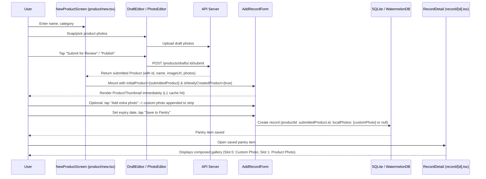

# Phase 1: Architecture & Product Photo Inheritance Contract

<!-- Updated: Red Team Review Session 1 - Concrete initialProduct contract, post-save multi-photo composition, and PrivateProductImage delegation -->

## Overview

Establish the data contract and props interface between `NewProductScreen` (`app/(app)/product/new.tsx`), `AddRecordForm` (`src/features/records/AddRecordForm.tsx`), and `RecordDetail` (`app/(app)/record/[id].tsx`). This guarantees that freshly created product photos are inherited synchronously without network delay, while post-save multi-photo composition preserves both the product photo and any newly appended custom photos.

## Requirements

### Functional
- In `app/(app)/product/new.tsx`, when `submittedProduct` is available, pass:
  - `productId={submittedProduct.id}`
  - `productName={submittedProduct.name}`
  - `initialCategory={submittedProduct.category}`
  - `initialProduct={submittedProduct}`
  - `isNewlyCreatedProduct={true}` (Strictly gated to products newly submitted in the current session)
  - `lockedPersonalScope={!isApproved}` (Strict tenant isolation for unmoderated drafts)
- In `app/(app)/product/new.tsx` for `resume === 'pending'`, pass:
  - `productId={product.id}`
  - `productName={product.name}`
  - `initialCategory={product.category}`
  - `initialProduct={product}`
  - Omit `isNewlyCreatedProduct` (defaults to `false` so resumed drafts do not trigger the newly-created banner)
  - `lockedPersonalScope={true}`
- In `src/features/records/AddRecordForm.tsx`:
  - Extend `Props` with `initialProduct?: Product | null` and `isNewlyCreatedProduct?: boolean`.
  - Derive `effectiveProduct = initialProduct ?? product`.
  - Derive `hasProductPhoto = Boolean(effectiveProduct?.imageUrl || (effectiveProduct?.photos && effectiveProduct.photos.length > 0))`.
  - Delegate photo rendering to `ProductThumbnail` (which internally routes to `PrivateProductImage` for non-active drafts and `normalizePhotoUri` for relative routes).
  - Storage contract: When no custom photos are added, save `photoUrl: null` and link `productId`. Client views resolve product photos via `productId`.
- In `app/(app)/record/[id].tsx` (Post-Save Composition Contract):
  - When `record.productId` exists and `productPhotos.length > 0`:
    - If `hasUserPhotos` is true, compose both: `savedPhotos = Array.from(new Set([...userPhotos, ...productPhotos]))`.
    - Restrict deletion: `isPhotoDeletable = (idx) => idx < userPhotos.length` (user custom photos can be deleted; the catalog product photo cannot).
    - If `!hasUserPhotos`, `savedPhotos = productPhotos` and `isProductFallback = true`.

### Non-Functional: Synchronous Metadata Handoff & Cold-Cache Lifecycle
- **Synchronous Metadata Handoff**: `initialProduct` provides the complete `Product` entity synchronously from the submission payload, rendering `AddRecordForm`'s photo section without awaiting React Query's `useProduct(productId)` network request.
- **Explicit Cold-Cache Lifecycle**:
  - When thumbnail bytes are already cached: renders `product-thumbnail-image` immediately.
  - When cache is cold or download is in flight: `useCachedImage` starts with `uri: null, isLoading: true`, and `ProductThumbnail` renders its built-in loading shimmer (`product-thumbnail-skeleton`) within the 68x68 container.
  - When network is offline or download fails: renders `product-thumbnail-fallback` with `fallbackIcon="cube-outline"`.
  - In all states, the `Product photo` badge remains visible and the redundant capture buttons are never shown.
- **Backward Compatibility**: Existing callers of `AddRecordForm` that omit `initialProduct` continue working unchanged.
## Architecture & Data Flow



## Related Code Files

- Modify: `apps/mobile/src/components/ProductThumbnail.tsx` (Implement `PrivateProductThumbnail` with skeleton and fallback)
- Modify: `apps/mobile/src/features/records/AddRecordForm.tsx` (Extend `Props`, derive `effectiveProduct`, wire photo rendering)
- Modify: `apps/mobile/app/(app)/product/new.tsx` (Pass `initialProduct` and `isNewlyCreatedProduct`)
- Modify: `apps/mobile/app/(app)/record/[id].tsx` (Post-save multi-photo composition and deletion gating)

## Implementation Steps

1. **Update `AddRecordFormProps` in `src/features/records/AddRecordForm.tsx`**:
   ```tsx
     productId?: string | null;
     productName?: string | null;
     customName?: string | null;
     initialCategory?: string | null;
     initialProduct?: Product | null;
     isNewlyCreatedProduct?: boolean;
     onSaved: (localId: string) => void;
     onOpenOcr?: () => void;
     lockedPersonalScope?: boolean;
     scannedBarcode?: string;
     scannedExpiry?: string | null;
   }
   ```

2. **Implement Private Draft Loading & Fallback in `ProductThumbnail.tsx`**:
   In `apps/mobile/src/components/ProductThumbnail.tsx`, replace the raw `PrivateProductImage` return with `PrivateProductThumbnail`:
   ```tsx
   function PrivateProductThumbnail({
     productId,
     photoId,
     size,
     style,
     fallbackIcon,
   }: {
     productId: string;
     photoId: string;
     size: number;
     style?: StyleProp<ImageStyle>;
     fallbackIcon?: string;
   }) {
     const theme = useTheme();
     const { uri, isLoading, error } = useCachedImage({
       target: { kind: 'draft', productId },
       photoId,
       variant: 'thumb',
     });
     if (isLoading && !uri) {
       return (
         <View testID="product-thumbnail-skeleton" style={[{ width: size, height: size }, style, styles.container, styles.loadingContainer, { backgroundColor: theme.colors.neutralLight }]}>
           <View style={[styles.spinnerBadge, { width: Math.max(26, Math.round(size * 0.54)), height: Math.max(26, Math.round(size * 0.54)), borderRadius: Math.round(size * 0.27), backgroundColor: theme.colors.bgGlass }]}>
             <ActivityIndicator size="small" color={theme.colors.primary} />
           </View>
         </View>
       );
     }
     if (error || !uri) {
       return (
         <View testID="product-thumbnail-fallback" style={[{ width: size, height: size }, style, styles.container, { alignItems: 'center', justifyContent: 'center', backgroundColor: theme.colors.neutralLight }]}>
           <Ionicons name={fallbackIcon as never} size={Math.max(14, Math.round(size * 0.36))} color={theme.colors.primaryDark} />
         </View>
       );
     }
     return (
       <View style={[{ width: size, height: size }, style, styles.container]}>
         <Image testID="product-thumbnail-image" source={{ uri }} style={[{ width: size, height: size }, style]} resizeMode="cover" fadeDuration={150} accessibilityIgnoresInvertColors />
       </View>
     );
   }
   ```

3. **Mandatory `ProductThumbnail` Wiring in `AddRecordForm.tsx`**:
   In `AddRecordForm.tsx`, when rendering `ProductThumbnail`, BOTH `product` and `firstPhoto` MUST be passed:
   ```tsx
   <ProductThumbnail
     product={effectiveProduct}
     firstPhoto={effectiveProduct?.photos?.[0]}
     size={68}
     style={styles.inheritedPhotoImage}
     fallbackIcon="cube-outline"
   />
   ```
   *Requirement Reason:* `ProductThumbnail.tsx:154-162` explicitly gates private draft rendering on `product?.id && firstPhoto?.id && product.status !== 'active'`. Omitting `firstPhoto` causes draft products to fail this gate and incorrectly fall back to the default basket icon.

4. **Wire `NewProductScreen` in `app/(app)/product/new.tsx`**:
   - At line 314 (`if (submittedProduct)`):
     ```tsx
     <AddRecordForm
       productId={submittedProduct.id}
       productName={submittedProduct.name}
       initialCategory={submittedProduct.category}
       initialProduct={submittedProduct}
       isNewlyCreatedProduct={true}
       lockedPersonalScope={!isApproved}
       onSaved={async () => {
         await ensurePushTokenRegistered();
         navigation.reset({ index: 0, routes: [{ name: 'Tabs' as never }] });
       }}
     />
     ```
   - At line 406 (`if (product && resume === 'pending')`):
     ```tsx
     <AddRecordForm
       productId={product.id}
       productName={product.name}
       initialCategory={product.category}
       initialProduct={product}
       lockedPersonalScope={true}
       onSaved={async () => {
         await ensurePushTokenRegistered();
         navigation.reset({ index: 0, routes: [{ name: 'Tabs' as never }] });
       }}
     />
     ```

5. **Implement Post-Save Multi-Photo Composition in `app/(app)/record/[id].tsx`**:
   - Update `savedPhotos` memoization (around lines 139–144):
     ```tsx
     const savedPhotos = React.useMemo(() => {
       if (hasUserPhotos) {
         return Array.from(new Set([...userPhotos, ...productPhotos]));
       }
       if (productPhotos.length > 0) return productPhotos;
       return [];
     }, [hasUserPhotos, userPhotos, productPhotos]);
     ```
   - Update `isPhotoDeletable` prop on `ItemImageGallery`:
     ```tsx
     isPhotoDeletable={(idx) => idx < userPhotos.length}
     ```
   - Update `handleDeletePhoto` and `executeDeletePhoto` to guard against deleting indices $\ge \text{userPhotos.length}$.

## Success Criteria
- [x] `AddRecordForm` receives `initialProduct` and displays the product photo section immediately without waiting for product metadata refetch.
- [x] Both `product` and `firstPhoto` are passed to `ProductThumbnail`, ensuring `PrivateProductImage` activates for private draft media.
- [x] Cold-cache loading (`product-thumbnail-skeleton`), image resolution, and error fallback (`product-thumbnail-fallback`) operate gracefully without showing redundant capture buttons.
- [x] Resumed drafts (`resume === 'pending'`) omit `isNewlyCreatedProduct`, strictly upholding negative gating.
- [x] When a pantry item with both a product photo and an appended custom photo is saved and reopened in `RecordDetail`, both photos remain visible in the gallery.
- [x] Monorepo typecheck passes with 0 errors.
## Risk Assessment

| Risk | Signal | Mitigation |
|---|---|---|
| Private draft media unauthenticated access | `<Image>` throws 401/403 | `ProductThumbnail` automatically routes draft photos through `PrivateProductImage`, attaching user bearer token. |
| Post-save photo overwrite | Product photo disappears after saving custom photo | `savedPhotos` in `RecordDetail` composes `[...userPhotos, ...productPhotos]` with `idx < userPhotos.length` deletion guard. |
