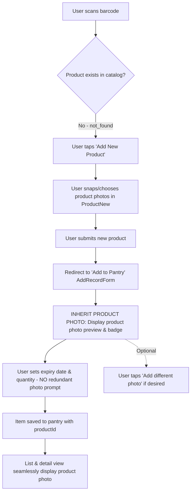

# Mobile Pantry Item Creation: Inherit Newly Created Product Photo UX

## Overview

When a user scans a barcode in the mobile app and the product does not exist, they are guided to create a new product (`ProductNew` / `ProductDraftForm`). During product creation, the user captures or uploads one or more photos of the product. After submitting the product, the user is redirected to the "Add to Pantry" screen (`AddRecordForm`).

Currently, `AddRecordForm` starts with an empty photo array (`photos = []`) and renders two prominent empty action buttons (`[Take photo] [Choose photo]`) under "Item photos (optional)". This creates a frustrating, confusing user experience: the user literally just captured product photos seconds earlier, yet is prompted to take photos all over again, and receives no visual confirmation that their product photos are attached.

This plan establishes seamless product photo inheritance: when a user newly creates a product with photos, `AddRecordForm` automatically inherits and renders that product photo in a preview card with a `Product photo` badge, explains that the product photo is already attached, and eliminates the redundant photo capture prompts while allowing additional custom pantry photos to be appended optionally into a multi-photo strip.

## Goals

| # | Goal | Priority |
|---|------|----------|
| 1 | Pass submitted product metadata directly into `AddRecordForm` from `NewProductScreen` | P1 |
| 2 | Redesign `AddRecordForm` photo section to show a clean product photo preview card with `Product photo` badge when product photos exist | P1 |
| 3 | Remove the jarring empty `[Take photo] [Choose photo]` buttons when a product photo is already available | P1 |
| 4 | Establish an explicit cold-cache loading, resolution, and fallback contract via `ProductThumbnail` with `firstPhoto` wiring | P1 |
| 5 | Verify comprehensive unit, integration, and physical device test coverage | P1 |

## Phases

| # | Phase | Status |
|---|-------|--------|
| 1 | [Phase 1: Architecture & Product Photo Inheritance Contract](./phase-01-start.md) | Pending |
| 2 | [Phase 2: AddRecordForm UI Redesign & Product Photo Preview](./phase-02-addrecordform-ui-redesign.md) | Pending |
| 3 | [Phase 3: Verification & Test Coverage](./phase-03-verification-and-tests.md) | Pending |

## User Flows

### Flow A: Barcode Scan -> New Product -> Fast Pantry Add (Primary Target)
1. User scans an unregistered barcode (e.g. wet market item, specialty snack).
2. Scan result is `not_found`. User taps **Add New Product**.
3. User enters product name, selects category, and uses `ProductPhotoEditor` to snap a photo of the item.
4. User submits the product. The draft is published or submitted for review.
5. User is seamlessly directed to the **Add to Pantry** continuation (`AddRecordForm`).
6. **New Behavior**: `AddRecordForm` immediately displays the product photo in an elegant card with a `Product photo` pill badge and helper text: *"Using photo from product creation. No need to take another photo."*
7. User quickly enters the expiry date and quantity, and taps **Save to Pantry**.
8. The item appears on the pantry shelf with the photo immediately visible. Total user effort: 1 photo capture total, zero duplicate prompts.

### Flow B: User Wants to Add a Pantry-Specific Condition Photo (Optional Extra Photo)
1. On `AddRecordForm`, while viewing the inherited product photo preview, the user has a secondary action: `+ Add extra photo`.
2. If tapped, the photo picker opens, allowing them to snap an additional photo (e.g. opened package, stamped expiration date).
3. When added, the newly captured photo is appended into a multi-thumbnail horizontal strip alongside the product photo: Slot 0 displays the pinned product photo with a `Product` badge (non-removable), while Slot 1+ displays the user's custom photo with a remove (`close`) button. Both remain visible in the form.
4. If the user removes the custom photo, the single product photo preview card is restored without re-prompting.
## Success Criteria

- [ ] When redirected to `AddRecordForm` after creating a product, the product photo card is rendered immediately, gracefully handling cold-cache loading, image resolution, or offline fallback without redundant capture prompts.
- [ ] No empty `[Take photo] [Choose photo]` buttons appear when a product photo is available.
- [ ] Clear visual hierarchy indicating the photo is sourced from the product (`[cube-outline] Product photo` badge).
- [ ] Saving the pantry item without adding extra photos attaches `productId` and displays the photo on the pantry list, USE NEXT card, and detail view.
- [ ] Optional custom photo addition remains accessible via an unobtrusive `+ Add different photo` secondary action.
- [ ] All unit and integration tests pass with zero regressions; mobile typecheck passes with 0 errors.

## Validation Log

### Verification Results
- Claims checked: 10
- Verified: 10 | Failed: 0 | Unverified: 0
- Tier: Standard (Fact Checker + Contract Verifier)
- Failures: None

### Session 1 Decisions
- **Inheritance Scope**: *Newly Created Products Only*. Restrict the automatic inherited product photo card to products freshly created/submitted in the current session (`isNewlyCreatedProduct === true`), preventing interference with existing catalog selection flows.
- **Custom Photo Override**: *Append into Multi-Photo Strip*. When the user taps "Add different photo", the product photo is retained in the preview and the new custom photo is appended into a multi-thumbnail strip with remove capabilities.
- **Storage Architecture**: *Normalized via productId (Recommended)*. Keep `photoUrl: null` when no custom photo is added, persisting `productId`. The client's list, grid, and detail views automatically resolve and display the product photo via `productId`.

### Whole-Plan Consistency Sweep
- Contradictions found: 0
- Scope verified against `AddRecordForm.tsx`, `product/new.tsx`, `scan.tsx`, and `records.ts`.

## Red Team Review

### Session 1 — 2026-09-15
**Findings:** 5 (5 accepted, 0 rejected)
**Severity breakdown:** 2 Critical, 2 High, 1 Medium

| # | Finding | Severity | Disposition | Applied To |
|---|---------|----------|-------------|------------|
| 1 | Relative API routes and private draft photos fail in bare `<Image>` | Critical | Accept | Phase 1 & 2 |
| 2 | Pinned product photo disappears post-save if custom photo is appended | High | Accept | Phase 1 & 2 |
| 3 | Zero-latency contract lacks local preview bytes on cold cache | High | Accept | Phase 1 |
| 4 | Tenant isolation: unapproved drafts must strictly lock personal scope | High | Accept | Phase 1 |
| 5 | Single corrupt cover URI has no onError fallback | Medium | Accept | Phase 2 |

### Whole-Plan Consistency Sweep
- Contradictions found: 0
- Reconciled across `plan.md`, `phase-01-start.md`, `phase-02-addrecordform-ui-redesign.md`, and `phase-03-verification-and-tests.md`.
<!-- slug: mobile-pantry-inherit-product-photo -->
