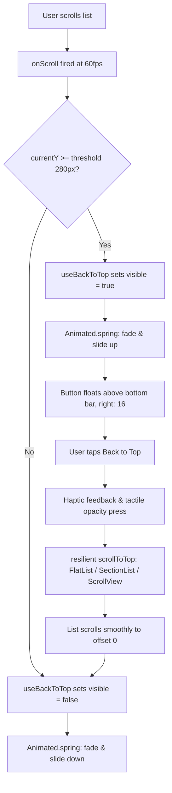

# Mobile Reusable 'Back to Top' Floating Button Architecture

## Overview

In the mobile application, users frequently browse long scrollable lists—such as the pantry inventory (`RecordList`), community giveaways (`GiveawayFeed`), local deals (`DealFeed`), community contributions (`contributions.tsx`), and product template drafts (`drafts.tsx`). Currently, once a user scrolls down tens or hundreds of items, they must manually fling and drag multiple times to return to the top search bar, filters, or header actions.

This plan establishes a lightweight, polished, reusable `BackToTopButton` component and companion `useBackToTop` hook. The button is completely hidden by default, gracefully transitions in once the user scrolls past a designated threshold (~280px), smoothly returns the list to offset 0 when tapped, and intelligently positions itself above safe areas and floating bottom navigation bars (`BottomActionNavBar`) so it never overlaps existing action controls.

## Design & Constraints

1. **Geometry & Styling**:
   - Small round circular button: diameter 42px, `borderRadius: 21`.
   - Icon: `Ionicons` `arrow-up` (size 20).
   - Elevation & Shadow: Theme-authoritative (Android `elevation: 5` in light theme, `elevation: 6` in dark theme; see Expyrico Palette Compliance below).
2. **Expyrico Palette Compliance** (`docs/design/expyrico-colour-palette.md`):
   - **Unified Brand Fill**: Solid **Fresh Sage (`#4BAE8A`)** circular fill across BOTH bright and dark themes.
   - **Icon**: **Warm White (`#FAFAF8`)** `arrow-up` (`Ionicons`, size 20, stroke/bold weight) for maximum contrast and legibility.
   - **Pressed State**: **Deep Sage (`#3A8F6F`)** with 0.9 opacity for crisp tactile feedback.
   - **Bright (Light) Theme Polish**: Soft diffuse shadow (`shadowColor: '#2C2C28'`, `shadowOffset: { width: 0, height: 3 }`, `shadowOpacity: 0.18`, `shadowRadius: 5`, Android `elevation: 5`) with hairline boundary (`borderWidth: StyleSheet.hairlineWidth`, `borderColor: 'rgba(58, 143, 111, 0.20)'`, referencing Deep Sage `#3A8F6F`).
   - **Dark Theme Polish**: Crisp luminous rim border (`borderWidth: 1`, `borderColor: 'rgba(214, 240, 230, 0.35)'` Mint Mist tint) with deep ambient shadow (`shadowColor: '#000000'`, `shadowOffset: { width: 0, height: 4 }`, `shadowOpacity: 0.45`, `shadowRadius: 8`, Android `elevation: 6`) ensuring vibrant separation against dark canvas backgrounds without introducing unapproved palette variants.
3. **Smart Vertical Positioning (No Overlap Guarantee)**:
   - Uses `useSafeAreaInsets()`.
   - When on tab screens (`hasTabBar={true}`): `bottom = insets.bottom > 0 ? insets.bottom + 68 : 76`, floating cleanly above the 52px floating action tab bar (`BottomActionNavBar`).
   - When on non-tab screens (`hasTabBar={false}`): `bottom = Math.max(insets.bottom, 16) + 16` (~32–48px).
   - Explicit `bottom` prop or `offsetBottom` prop allows per-screen fine tuning if a screen renders custom sticky footers.
4. **Animation & Accessibility**:
   - Native-driver animated spring (`opacity: 0 -> 1`, `translateY: 8 -> 0`, `scale: 0.85 -> 1`).
   - `pointerEvents={visible ? 'auto' : 'none'}` prevents touches when hidden.
   - `accessibilityRole="button"` and `accessibilityLabel="Scroll back to top"`.

## Goals

| # | Goal | Priority |
|---|------|----------|
| 1 | Create reusable `BackToTopButton` component and `useBackToTop` hook with resilient scroll handling for `FlatList`, `SectionList`, and `ScrollView` | P1 |
| 2 | Integrate into primary feed screens (`RecordList`, `PantryHistoryView`, `GiveawayFeed`, `DealFeed`) | P1 |
| 3 | Integrate into secondary long lists (`contributions.tsx`, `drafts.tsx`, `CommunityReviewsFeed.tsx`) | P1 |
| 4 | Verify zero visual overlap with floating bottom action bars and tabs | P1 |
| 5 | Verify typecheck, unit test suites, local Gradle build, and physical Android device behavior via `adb` | P1 |

## Phases

| # | Phase | Status |
|---|-------|--------|
| 1 | [Phase 1: Reusable Component & Hook Architecture](./phase-01-start.md) | Pending |
| 2 | [Phase 2: Primary Feed Screen Integrations](./phase-02-primary-feed-integration.md) | Pending |
| 3 | [Phase 3: Secondary Long Lists Integration](./phase-03-secondary-lists-integration.md) | Pending |
| 4 | [Phase 4: Verification, Testing & Physical Device Validation](./phase-04-verification-and-testing.md) | Pending |

## User Flows

1. **Browsing Long Pantry Inventory**: User scrolls down through 30+ pantry items. Once past 280px, the small round Fresh Sage button smoothly slides in at the bottom-right corner, floating neatly above the Scan/Manual Input floating bar. User taps it: the list smoothly animates back to the top search bar, and the button fades away.
2. **Browsing Giveaways & Deals**: User scrolls through giveaway offers. The button appears. Tapping it smoothly returns to the top filter pills without obstructing the "Add Giveaway" or "Add Deal" bottom action button.
3. **Browsing Contributed Products**: User views their contribution history. The button appears above the safe area bottom and smoothly scrolls back to the contributor hero card and search bar.

## Success Criteria

- [ ] Reusable `BackToTopButton` and `useBackToTop` hook created in `apps/mobile/src/components/BackToTopButton.tsx`.
- [ ] Universal scroll-to-top handler supports `FlatList`, `SectionList`, and `ScrollView` without crashes or empty-list errors.
- [ ] Integrated across at least 6 target screens: Pantry (`RecordList`), Pantry History (`PantryHistoryView`), Giveaways (`GiveawayFeed`), Deals (`DealFeed`), Community Contributions (`contributions.tsx`), and Product Templates/Drafts (`drafts.tsx`).
- [ ] Button is completely hidden at top of list and smoothly fades/slides in only after user scrolls down >280px.
- [ ] Button is placed at right: 16 and sits above bottom action bars without overlapping.
- [ ] Unit tests in `BackToTopButton.test.tsx` pass.
- [ ] Mobile TypeScript typecheck passes with 0 errors.
- [ ] Debug APK builds and installs cleanly on physical Android device via `adb`.

## Validation Log

### Verification Results
- Claims checked: 9
- Verified: 9 | Failed: 0 | Unverified: 0
- Tier: Standard (Fact Checker + Contract Verifier)
- Verified references: `RecordList.tsx:1020` (`SectionList`), `RecordList.tsx:416` (`handleListScroll`), `PantryHistoryView.tsx:315` (`FlatList`), `GiveawayFeed.tsx:357` (`FlatList`), `DealFeed.tsx:300` (`FlatList`), `contributions.tsx:38,146` (`listRef`, `handleListScroll`), `drafts.tsx:258,259` (`scrollY`, `listRef`), `CommunityReviewsFeed.tsx:238` (`FlatList`), `TabsNavigator.tsx:146,322` (52px bar, insets).

### User Decisions (Validation Session 1)
1. **Button Visual Styling**: **Filled Fresh Sage (`#4BAE8A`)** in BOTH light and dark themes. Small round circular button (diameter 42px, radius 21px) with Warm White (`#FAFAF8`) icon, Deep Sage (`#3A8F6F`) on press. Light theme uses soft diffuse shadow; dark theme uses luminous Mint Mist hairline rim (`rgba(214, 240, 230, 0.35)`) and deep shadow. Zero unapproved dark-card palettes (`#1B2620` removed).
2. **Scroll Visibility Threshold**: **280px (Early Access)**. The button appears as soon as the user scrolls past approximately 2–3 inventory cards, providing early return access without cluttering short lists.
3. **Idle Behavior**: **Auto-fade on Inactivity (2.5s timeout)**. When scrolling stops for 2.5 seconds, the button gracefully fades out to maintain a clean reading view. The moment the user resumes scrolling or touches the list (and scroll offset remains >= 280px), the button instantly fades back in.

### Whole-Plan Consistency Sweep
- Clean: Zero contradictory claims. Removed conflicting `#1B2620` dark-card draft alternative.
- Verified Fresh Sage fill / Warm White icon consistency across both themes in all plan and phase files per `AGENTS.md` Expyrico colour mandates.
- Auto-fade timer requirement propagated into component architecture and all screen integration phases.

<!-- slug: mobile-back-to-top-scroll-button -->
