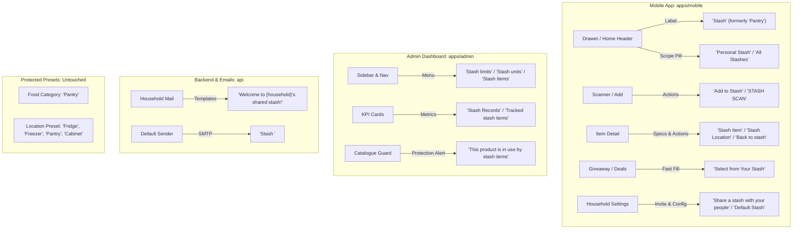

# Rename 'Pantry' Word Phrase to 'Stash' Implementation Plan

## Overview

This plan comprehensively updates the user-facing brand terminology from **"Pantry"** to **"Stash"** (capitalized as appropriate: "Stash", "stash", "Personal Stash", "All Stashes", "Stash Items") across all user-facing surfaces:
1. **Mobile App (`apps/mobile`)**: Navigation drawer, tabs, headers, empty states, scanner action buttons, item details, modals, giveaway fast fill, household settings, and onboarding/auth screens.
2. **Admin Dashboard (`apps/admin`)**: Sidebar navigation, dashboard KPI cards, analytics cards, settings forms (stash limits, stash units), product catalogue merge/delete prompts, and item management explorer views.
3. **Emails, Notifications & Workers (`api`)**: Household invitation/joined emails, system notification headers, default SMTP sender strings, and worker queue comments.
4. **Shared Package (`@expyrico/shared`)**: Gamification Level 4 badge title ("Pantry Scout" → "Stash Scout").

### Strict Exclusions (MUST NOT change to Stash)
- **Food Category list**: `Produce`, `Dairy`, `Bakery`, `Pantry`, `Meat`, `Frozen` (the food category represents shelf-stable dry goods/staples and must remain `Pantry`).
- **Storage Location Preset**: `Fridge`, `Freezer`, `Pantry`, `Cabinet`, `Counter` (the physical storage furniture/room where goods are placed remains `Pantry`).
- **Admin Location Presets**: `['Fridge', 'Freezer', 'Pantry', 'Cabinet', 'Counter']`.

### Technical Invariants
- **Database Schema**: Prisma models (`Record`, `Household`, `Product`, `User`, `SystemSetting`) and database table names (`records`, `households`, `system_settings`) remain intact with zero breaking schema migrations.
- **REST APIs & IPC Contracts**: API route endpoints (`/v1/records`, `/v1/admin/settings/pantry-limits`, etc.) remain backward-compatible to avoid breaking existing clients during rolling deployments.
- **Internal Storage Keys**: Persistent WatermelonDB names (`dbName: 'pantry'`) and local storage namespaces (`pantry.access_token`, `pantry.pushRegisteredV2`) remain stable to ensure seamless client updates without data loss.

---

## User Flow & System Terminology Mapping

---

## Phases

| # | Phase | Status | Priority | Effort | Deliverables |
|---|-------|--------|----------|--------|--------------|
| 1 | [Shared Gamification & Contributor Levels](./phase-01-shared-gamification-and-contributor-levels.md) | Pending | P1 | 30m | Update Level 4 tier title from "Pantry Scout" to "Stash Scout" in `@expyrico/shared` and associated unit tests. |
| 2 | [Mobile Navigation, Drawer & Home Screen](./phase-02-mobile-navigation-drawer-and-home.md) | Pending | P1 | 1.5h | Update drawer menu, scope toggle labels, home greeting, tabs, empty state, and offline sync banners. |
| 3 | [Mobile Scanner, Product Add & Drafts UX](./phase-03-mobile-scanner-product-add-and-drafts.md) | Pending | P1 | 1.5h | Update "PANTRY SCAN" eyebrow, "Add to Stash", "Add as Private Item for My Stash", fast-add modals, and draft actions. |
| 4 | [Mobile Item Detail, Giveaways & Settings](./phase-04-mobile-item-detail-giveaways-and-settings.md) | Pending | P1 | 2h | Update fallback labels, error messages, delete dialogs, fast fill giveaways, default stash settings, and auth screen descriptions. |
| 5 | [Admin Dashboard Navigation & Settings](./phase-05-admin-dashboard-navigation-and-settings.md) | Pending | P1 | 1.5h | Update admin sidebar nav, KPI cards, stash limits/units form copy, product catalog delete/merge guard warnings, and explorer UI. |
| 6 | [Server Emails, SMTP & System Workers](./phase-06-server-emails-smtp-and-workers.md) | Pending | P2 | 30m | Update household invitation and welcome emails, `.env.example` defaults, and notification worker comments. |
| 7 | [Verification, Testing & Device Validation](./phase-07-verification-testing-and-device-validation.md) | Pending | P1 | 1h | Run unit test suites across all packages, perform Android debug build, and verify live on Xiaomi phone via screenshot capture. |

---

## Success Criteria

- [ ] Contributor Level 4 tier title is updated to `"Stash Scout"` in `@expyrico/shared`.
- [ ] Mobile app Home screen displays `"Stash"` greeting, `"Personal Stash"` / `"All Stashes"` scope pill, and `"Start your stash"` empty state.
- [ ] Scanner renders `"STASH SCAN"` viewfinder eyebrow and `"Add to Stash"` action buttons.
- [ ] Item detail screen (`record/[id].tsx`) displays `"Stash Item"` fallback, `"Stash Location"`, and `"Back to stash"`.
- [ ] Community Giveaway creation hero card displays `"Select from Your Stash"` (FAST FILL) with updated modal copy.
- [ ] Household settings and share invitations display `"Share a stash with your people"` and `"Default Stash for New Items"`.
- [ ] Auth screens (Welcome, Sign In, Sign Up, Reset Password) display consistent Stash descriptions.
- [ ] Admin dashboard sidebar displays `"Stash limits"`, `"Stash units"`, and `"Stash Records"` KPI.
- [ ] Admin product catalogue delete/merge guard warnings refer to `"stash items"` and `"stash records"`.
- [ ] Household invitation email displays `"Shared Stash Invitation"` and `"Welcome to {householdName}'s shared stash!"`.
- [ ] **Preserved**: Storage location selector presets still display `'Pantry'` (`Fridge`, `Freezer`, `Pantry`, `Cabinet`, `Counter`).
- [ ] **Preserved**: Food category quick chips still display `'Pantry'` (`Produce`, `Dairy`, `Bakery`, `Pantry`, `Meat`, `Frozen`).
- [ ] All unit tests pass across `@expyrico/shared`, `@expyrico/mobile`, `@expyrico/admin`, and `api`.
- [ ] Android APK builds successfully and live physical device screenshots confirm visual consistency.

---

## Validation Log

### Verification Results
- **Claims checked**: 24
- **Verified**: 24 | **Failed**: 0 | **Unverified**: 0
- **Tier**: Full (all phases verified against active source code)
- **Failures**: None.

### Critical Questions Interview Decisions
1. **Scope Pluralization**: Confirmed **"All Stashes"** for combined multi-scope views (matching "Personal Stash" / "All Stashes").
2. **Home Tab Label**: Confirmed keeping **"In Stock"** for the active inventory tab, while updating tab accessibility and history tab to **"Stash history"**.
3. **Admin URL Routes**: Confirmed **preserving existing Next.js URL routes** (`/settings/pantry-limits`, `/settings/pantry-units`, `/pantry-items`) and updating all visual labels, headings, toasts, and KPI cards to "Stash", avoiding breaking bookmarks or external links.
4. **Local Database & Storage Keys**: Confirmed **keeping internal mobile SQLite / WatermelonDB database names (`dbName: 'pantry'`) and local storage keys intact**, preventing any risk of local database wipe or sync epoch invalidation.

### Whole-Plan Consistency Sweep
- **Old Terminology Check**: Verified that no stale references to "Pantry Scout" or un-scoped "Pantry" remain in active user-facing descriptions.
- **Exclusion Guard**: Verified that `'Pantry'` food category chips and storage location presets (`'Fridge', 'Freezer', 'Pantry', 'Cabinet', 'Counter'`) are explicitly preserved across all phase specifications.
- **Interface Consistency**: Verified that phase files 01 through 07 align with all confirmed decisions.
- **Unresolved Contradictions**: 0.

---

## Red Team Review

### Session — 2026-09-18
**Findings:** 5 (5 accepted, 0 rejected)
**Severity breakdown:** 1 Critical, 2 High, 2 Medium

| # | Finding | Severity | Disposition | Applied To | Codebase Evidence |
|---|---------|----------|-------------|------------|-------------------|
| 1 | Missing mobile vendored package sync (`local-packages/@expyrico/shared`) | Critical | Accept | Phase 1 | `apps/mobile/package.json:22`, `docs/build-and-release.md:21-23` |
| 2 | Subshell path trap in Phase 7 Gradle and ADB execution chain | High | Accept | Phase 7 | `phase-07:74-75` (`cd apps/mobile && ...`) |
| 3 | API product delete endpoint leaks "pantry items" error detail to admin modal | High | Accept | Phase 5 | `api/src/routes/admin/products/delete.ts:70`, `apps/admin/.../delete-product-modal.tsx:57` |
| 4 | Persisted `contributor_levels` setting row in DB overrides updated shared defaults | Medium | Accept | Phase 1 | `api/src/services/admin/settings.ts:85`, `settings` table |
| 5 | Hardcoded test assertions and Jest snapshots break on text changes | Medium | Accept | Phases 3, 4, 5 | `product-drafts.test.tsx:228`, `scan.test.tsx:457`, `products-delete.test.ts:83` |

### Whole-Plan Consistency Sweep
- **Vendored Sync Parity**: Phase 1 now explicitly includes `rm -rf apps/mobile/local-packages/@expyrico/shared/dist && cp -R packages/shared/dist apps/mobile/local-packages/@expyrico/shared/dist && pnpm install` and mobile node verification.
- **Path Traps Resolved**: Phase 7 wraps the Gradle command in a subshell `(cd apps/mobile && ...) && adb install -r apps/mobile/...` to ensure directory consistency.
- **Backend/Frontend Error Alignment**: Phase 5 includes `api/src/routes/admin/products/delete.ts` to ensure error details return `"used by N stash items"`.
- **Settings Override Guard**: Phase 1 includes a database check to update any legacy `'Pantry Scout'` entry stored in `settings`.
- **Test Assertions Mapped**: Phases 3, 4, and 5 explicitly enumerate test assertion updates.
- **Unresolved Contradictions**: 0.
